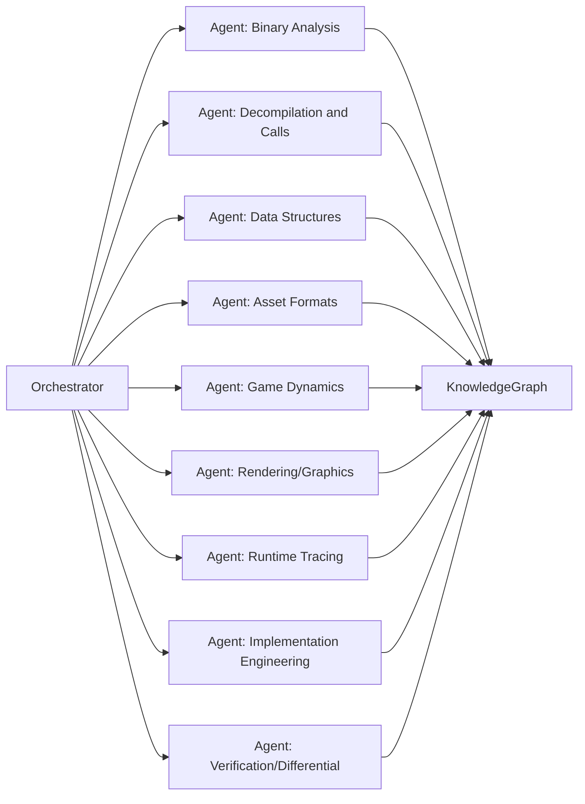

# Executive Summary
The **OpenSpore** project proposes creating an open repository for a clean reimplementation of *Spore* (base game) and its expansions (e.g. *Galactic Adventures*) from scratch, using reverse engineering tools and LLMs. A pipeline of specialized agents (binary analysts, structure analysts, rendering analysts, etc.) will be orchestrated by a main agent, sharing information through a *knowledge graph* (e.g. Neo4j). Key dependencies include Ghidra, Wine, debuggers (gdb/lldb), Python, Vulkan/SDL3, and an advanced local LLM (e.g. Qwen 3.8 27B) to assist with code generation and analysis. An incremental plan will be followed: first foundations (data types, serialization, development ecosystem), then basic simulation (cell/creature stage), then editors (creatures, tribes) and finally rendering and advanced stages. Expansion support will be integrated in later phases. A differential verification process using Wine as an oracle will be defined (run original *Spore* vs. reimplementation, compare states and outputs). Collaboration templates will also be established (issues/PRs, CONTRIBUTING.md), along with legal guidelines (do not distribute proprietary assets, "clean-room" reverse engineering in accordance with the law). The target audience is intermediate/advanced developers in C++ and reverse engineering. This BOOTSTRAP.md details everything above with concrete steps, commands and diagrams to kick off the project.

## Project Objectives
- **Scope:** Reimplement *Spore* (base game) and its main expansions (e.g. *Galactic Adventures*, *Creepy & Cute Parts Pack*) in open source, separating logic from data and including no proprietary assets or code. The repository will live in Git (GitHub/GitLab/OpenCode).
- **Short-term goals (0–3 months):**
  - Set up the analysis environment: install tools (Ghidra, Wine, etc.), import the *Spore* executables into Ghidra with the modding SDK information, and run the game under Wine.
  - Define the *knowledge graph*: initial node schema (e.g. *Class*, *Function*, *Structure*, *Resource*), attributes (offset, name, description) and candidate formats (Neo4j, GraphML, SQLite). Initial comparison of options (see dedicated section).
  - Configure the agent pipeline: outline specialized agents (binary analyst, structures analyst, execution tracer, rendering analyst, etc.) and communication mechanisms (REST/JSON APIs, MCP protocols, or gRPC). Create an initial workflow diagram (see diagram).
  - Establish basic templates: issues, pull requests and a minimal CONTRIBUTING.md. Include a style guide (C++17, fmt, Unicode in comments, etc.) and commit conventions.
- **Mid-term goals (3–12 months):**
  - Reach a minimally functional reimplementation of the **basic database and simulation**: e.g. be able to load a creature world and simulate one iteration of the cell/creature stage, validated against the original game.
  - Complete the first set of automated differential tests (scripts in CI) for the initial stages.
  - First engine components: fundamental structures (e.g. Vector3, Stream, ResourceManager) and a first entity/spawner system.
  - Design of the *Spore* data schema, adapted to C++ (class inheritance, RTTI, limited introspection, etc.), documented in the knowledge graph with example nodes (Creature, Renderer, Resource).
- **Long-term goals (>12 months):**
  - Full reimplementation of the remaining stages: tribe, civilization, space.
  - Implement integrated editors (creature creator, vehicles, buildings, *GA* missions).
  - Implement a modern graphics pipeline (Vulkan/SDL3) that reproduces the look of *Spore*.
  - Progressive integration of expansions (GA, Bot Parts, DLC) following the roadmap.
  - Stabilize continuous testing: every accepted feature generates automated tests, with comparisons against the Wine results.
  - CI/CD deployment (GitHub Actions/GitLab CI) with containers/Docker for reproducible environments.

## Legal and Licensing Requirements
- **Clean reverse engineering:** *Clean-room reverse engineering* will be performed. The team must legally own a copy of *Spore* and its expansions. Under the **Spanish Intellectual Property Act** (art. 100 LPI), it is permitted to study the internal workings of a program if you are a legitimate user. Code reproduction (decompilation) is only lawful to achieve interoperability, limited to what is strictly necessary. It is **forbidden** to copy source code to create a substantially similar program, so OpenSpore must reimplement the logic by analysis, not by directly copying EA's code.
- **Proprietary assets:** No *Spore* assets (models, textures, sounds, scripts) will be distributed, as they are owned by EA. Instead, the project must include mechanisms (scripts or instructions) for each user to extract their own assets from their original copy (e.g. CD or legal installers) and place them in recognized directories. The README/CONTRIBUTING must make it clear that **the project contains no assets**, and that users must provide them.
- **Code licenses:** OpenSpore code will be released under a free license (e.g. MIT or Apache 2.0), similar to other reverse engineering projects. The tools used (Ghidra Apache-2.0, Wine LGPL, radare2 LGPL/MIT, SDL3 zlib, Vulkan Apache-2.0) have open and compatible licenses. The Qwen model has its own license (hosted by its maintainer); use under its terms will be assumed, or a similar model (inference-only, no commercial use) will be proposed.
- **Notices and disclaimers:** Include a *Disclaimer* section in the documentation stating that no infringement of EA's rights is intended, that the original copies of *Spore/Galactic Adventures* are required, and that any use of reverse engineering must comply with local law (see legal note). For example: "**Warning:** This project is for research purposes only and will never distribute proprietary code or assets. The use of reverse engineering will be strictly limited to analysis for interoperability."
- **Community and ethics:** A community *Code of Conduct* (e.g. Contributor Covenant) will be encouraged for collaboration. Inclusion of malware must be penalized (do not download suspicious DLLs). Every contribution must adhere to the spirit of openness and responsibility (do not use trade secrets or leaked code).

## Dependencies and Tools
Each necessary dependency is detailed below, with recommended version, installation steps on Linux and official sources:

| Dependency             | Recommended version    | Installation (Ubuntu 22.04)                                    | Official link/documentation (ES/English)                 |
|------------------------|------------------------|-------------------------------------------------------------|----------------------------------------------------------|
| **Ghidra** (NSA)        | 10.3.x (or higher)     | ```bash<br>sudo apt update<br>sudo apt install openjdk-17-jdk unzip<br>wget https://ghidra-sre.org/ghidra_<version>_PUBLIC.zip<br>unzip ghidra_<version>_PUBLIC.zip -d ~/apps/ghidra<br>``` | [Ghidra (NSA)](https://ghidra-sre.org) (ES: no official docs, use the NSA website) |
| **radare2** (rizin)     | Latest (0.18+)         | ```bash<br>sudo apt install radare2```                       | [radare2 (GitHub)](https://github.com/radareorg/radare2)  |
| **LLDB** (LLVM debugger)| 15.x                  | ```bash<br>sudo apt install lldb```                          | [LLVM](https://llvm.org) (in English)                     |
| **gdb** (GNU debugger)  | 12.x                  | ```bash<br>sudo apt install gdb```                           | [GNU gdb](https://www.gnu.org/software/gdb/) (in English)  |
| **Wine**                | wine-stable 8.x or 9.x | ```bash<br>sudo dpkg --add-architecture i386<br>wget -nc https://dl.winehq.org/wine-builds/winehq.key<br>sudo apt-key add winehq.key<br>sudo apt-add-repository 'deb https://dl.winehq.org/wine-builds/ubuntu/ jammy main'<br>sudo apt update<br>sudo apt install --install-recommends winehq-stable``` | [WineHQ](https://wiki.winehq.org/Ubuntu) (in English)        |
| **Spore (Windows)**     | *GOTY or Steam*        | 1. Place the ISO or download from GOG/Steam. <br>2. ```bash<br>export WINEPREFIX=~/wine-spore<br>wine64 spore_installer.exe<br>wine64 galactic_adventures_installer.exe<br>```<br>3. Patch to v1.5.1 with the official fix.<br>4. (Optional) Install the C&C Expansion if used. | – (Game; obtain legally: GOG.com or EA App)           |
| **Spore ModAPI SDK**    | 1.1.11 (mod sporecommunity) | ```bash<br>git clone https://github.com/Spore-Community/Spore-ModAPI.git<br>``` (see README) | [Spore-ModAPI SDK](https://github.com/Spore-Community/Spore-ModAPI) |
| **Spore ModLoader/Manager** | v1.x (Rosalie241)   | ```bash<br>git clone https://github.com/Rosalie241/SporeModLoader.git<br>cd SporeModLoader<br>make all<br>```<br>To install mods (Linux): use SporeModManager (see README). | [SporeModLoader GitHub](https://github.com/Rosalie241/SporeModLoader) |
| **C/C++ Compiler & Build** | GCC 11+ or Clang 14+ | ```bash<br>sudo apt install build-essential clang cmake git```             | [GCC](https://gcc.gnu.org), [Clang](https://clang.llvm.org) |
| **SDL3** (Simple DirectMedia Layer) | 3.x | ```bash<br>sudo apt install libsdl3-dev```                          | [SDL3](https://libsdl.org/) (official page, in English)  |
| **Vulkan SDK**         | 1.3.x (LunarG)       | ```bash<br>sudo apt install libvulkan-dev vulkan-utils```         | [LunarG Vulkan SDK](https://vulkan.lunarg.com/) (in English) |
| **Python 3.9+**        | 3.10                | ```bash<br>sudo apt install python3 python3-pip libclang-dev```    | [Python 3](https://www.python.org/)                        |
| **Qwen 3.8 27B**       | 27B parameters      | *Install the local model (GPU recommended, e.g. RTX 3090/AMD 7900)*. Use [LM Studio](https://lmstudio.io/) or a HuggingFace container. (E.g. in [30†L231-L239] a Pi agent configuration with LMStudio is shown). ~25GB VRAM is required (e.g. AMD 7900 XTX 24GB). | – (AI model, see Qwen source) |

- **Notes:** For each tool it is recommended to always obtain it from official sources or trusted repositories. For example, Ghidra from the official NSA website, Wine from WineHQ, Vulkan from LunarG, etc. If guides exist in Spanish, link them (for example, the [Spanish section of the WineHQ wiki](https://wiki.winehq.org/), though sometimes only English is available).

## Installing Spore under Wine and Organizing Assets
1. **Install Spore base and expansions:** Create a dedicated *wineprefix* for Spore and run the Windows installers:
    ```bash
    export WINEPREFIX="$HOME/.wine-spore"
    wine64 /path/to/SporeSetup.exe              # Official Spore installer
    wine64 /path/to/SporeGalacticAdventures.exe # If you have the GA expansion
    ```
    Make sure to patch the game to the final version (1.5.1), following the instructions from Davoonline or the Spore forum. The **GOTY or GOG** version (no DRM) is recommended to avoid problems with the EA installer.
2. **Basic verification:** After installing, run:
    ```bash
    winecfg                  # configure DLL overrides (set dinput8=native)
    wine "$WINEPREFIX/drive_c/Program Files/Spore/SporeApp.exe"
    ```
    If the game launches, it is ready. It may be useful to install **Spore ModLoader** to facilitate mods on Linux.
3. **Obtaining assets:** The project **does not distribute .package files or resources**. Each developer must export their own assets from the original game. Community tools can help, for example:
    - **Spore ModAPI Easy Installer:** allows downloading mods in `.package` format from Davoonline. It can be used as follows:
      ```bash
      WINEPREFIX=$HOME/.wine-spore wine "$WINEPREFIX/drive_c/ProgramData/SPORE ModAPI Launcher Kit/Spore ModAPI Easy Installer.exe"
      ```
      The mod installer (LauncherKit) will open to add existing community mods.
    - **Resource extractors:** Use community tools (SporeTools, SporeModule, gmdtool, DDS/TGA extractors) to extract textures, models and sounds. For example, [JeanxPereira's Darkspore BMDL importer](https://github.com/JeanxPereira/BMDL-Importer) demonstrates how to reconstruct 3D models and shaders directly from the game files. It is recommended to organize assets in clear folders (e.g. `Data/Spore/Creatures/`, `Textures/`, `Sounds/`).
4. **SporeModLoader/Manager on Linux:** To load your own mods or community mods on Linux, it is advisable to use **SporeModLoader** together with **SporeModManager** (loader and CLI manager). After compiling (see Dependencies section), copy the resulting executable to the game directory (the folder containing `SporeApp.exe`). From the command line you can install/uninstall mods without a graphical interface. This works better than the Windows ModAPI Launcher.

## Setting Up the Analysis Environment
- **Ghidra project:** Open a new project in Ghidra and import the main *Spore* executable (`SporeApp.exe`). Analyze the binary to detect functions. Then use the ModAPI SDK script to load known symbols and structures:
  1. Download the **Spore ModAPI SDK** (v1.1.x) and locate the `SDKtoGhidra/GhidraScript` folder within the project.
  2. In Ghidra, open the *Script Manager* (`Windows > Script Manager`), add the path to `SDKtoGhidra/GhidraScript`, and run `ImportSporeSDK.java`. Select the appropriate data file (`SporeGhidra_disk.xml` for a disk installation, or `SporeGhidra_march2017.xml` for the digital version).
  3. This will load into the Ghidra project all the data types, constants and signatures from the modding SDK, improving decompilation. (Note: Ghidra does not recognize inheritance or virtual functions, so the pseudo-C output will be approximate).
- **Templates and scripts:** Create Ghidra scripts for repetitive tasks (e.g. renaming popular functions, extracting vtable data, etc.). You can configure batch analysis (*headless mode*) with `analyzeHeadless`:
  ```bash
  ghidra_10.3.8_PUBLIC/support/analyzeHeadless ~/ghidra_project/SporeProject -import SporeApp.exe -scriptPath ~/apps/ghidra/SDKtoGhidra/GhidraScript -postScript ImportSporeSDK.java SporeGhidra_disk.xml
  ```
- **Example workflows:** Some useful tasks and tools:
  - **Decompilation and navigation:** Use Ghidra's decompiler to read function logic. Look for virtual tables (vtable) of key classes (e.g. `Creature`, `Building`). The SDK scripts have information about virtual method offsets.
  - **Identifying structures:** Compare with the ModAPI SDK: structure names in Ghidra should match (e.g. `Evo::Creature`, `UniverseManager`). Use the *Defined Data* function to map pointers.
  - **Static analysis:** Use radare2 (`r2 -AA SporeApp.exe`) as an alternative for navigating assembly or scripting.
  - **Runtime tracing:** You can use `wine64-spawn` with gdb/lldb:
    ```bash
    WINEPREFIX=$HOME/.wine-spore gdb --args wine64 "$WINEPREFIX/drive_c/Program Files/Spore/SporeApp.exe"
    ```
    and set breakpoints (for example, at `Evo::GameStart()` or render functions). Also enable Wine logging (`WINEDEBUG=+relay`) to see Windows/DX API calls.

## Knowledge Graph Design
A *knowledge graph* is proposed to represent Spore entities and relationships (classes, methods, resources, dependencies). Initial example nodes and attributes:
- **Creature**: name, internal identifier, type (planet/ally/enemy), list of parts (legs, eyes, mouths) and stats (health points, damage).
- **Resource**: identifier (e.g. `.package` file name), type (texture/model/audio), hash, size, pointers to usages (which classes load it).
- **Renderer**: graphics technique name, associated shaders, dependencies (textures, meshes).
Each node should include confidence attributes ("validated?", "origin: static/dynamic/SDK") and cross-references. The graph allows querying relationships (e.g. "Which parts does the Creature class use?").

**Storage format:** Several options are evaluated (comparison table below). A native graph database like Neo4j (proprietary + open source) allows efficient Cypher queries. Alternatives:
SQLite can be used with a relational schema (lower installation cost), GraphML/JSON Graph (simple, portable), or databases like ArangoDB (multi-model). An abstraction layer will be implemented to change format if necessary. Additionally, expose query APIs via REST/GraphQL for agents.

| Technology / Format    | Type          | Advantages                                             | Disadvantages                                         |
|------------------------|---------------|------------------------------------------------------|-------------------------------------------------------|
| **Neo4j (Community)**   | Graph DB   | Powerful Cypher language, ACID transactions, mature visualizations; ideal for dense graphs. | Requires Java; GPL license with enterprise assumptions (Community is free). |
| **SQLite + RDF schema**| Relational *+* graph via JSON | Easy to install (embedded DAO), portable (single file), RDF extensions can be used. | Not a native graph DB; logic is needed for complex queries. |
| **GraphML/GraphML**     | Text XML file | Open standard, readable, portable (e.g. for export/import). | No native query capability; suffers with very large graphs. |
| **ArangoDB**            | Multi-model DB | Supports graph queries (AQL) and key-value, Apache license. | More complex configuration; smaller community than Neo4j. |
| **JanusGraph/TinkerPop**| Graph DB (NoSQL) | Supports scalability (based on Cassandra/HBase). | Overkill for a small project; learning curve. |

We will start with Neo4j (Community Edition) due to its robustness with graphs and support for intelligent agents.

**Example entries in the graph:**
- *Creature{Name="Blob", Type="Herbivore", HP=30, Atk=5}*, relationship *hasPart*→ *BodyPart{Name="Tentacle", Position="Spine"}*.
- *Resource{Name="bones.package", Type="Mesh"}*, relationship *usedBy*→ *Renderer{Name="CreatureRenderer"}*.
- *Class{Name="Renderer", Superclass="Object"}* and associated methods as *Method{Name="Draw"}* nodes.

The agents (in the next section) will use Cypher to query the graph (e.g. `MATCH (c:Creature)-[:hasPart]->(p) RETURN c,p`). The graph will also act as the agents' "memory" for tracking what has already been analyzed.

## Agent Architecture and Pipeline
OpenSpore will use **specialized agents** orchestrated in a multi-step AI pipeline. The following diagram illustrates the workflow:



- **Orchestrator:** Coordinates the tasks, assigns work to agents and updates the global knowledge. It can be a master script or service that manages work queues.
- **Binary Agent:** Uses Ghidra/radare2 to disassemble *SporeApp.exe*, identifying key functions (stage starts, game loops, library calls). Extracts pointers to vtables and function references.
- **Decompiler Agent:** Processes Ghidra's output to generate pseudo C code, identifies high-level logic (game conditions, algorithms).
- **Structures Agent:** Devotes its analysis to discovering data structures (classes, field offsets) from SDK symbols and heuristics (e.g. `this->` patterns in assembly).
- **Asset Formats Agent:** Investigates data file formats (`.package`, `.gmd`, `.dds`, `.bmdl`, `.bgeo`, etc.), generating structure mappings. (E.g. uses the Darkspore BMDL schema, studies `.mat` material files).
- **Game Dynamics Agent:** Runs simulations under Wine in debug mode to observe real-time behavior (e.g. creature movement, tribe AI).
- **Rendering Agent:** Analyzes the graphics part: extracts shaders, effects (see [38†L214-L221]), reconstructs the graphics pipeline (OpenGL/Vulkan).
- **Runtime Tracing Agent:** Uses GDB/LLDB together with Wine to extract live information (e.g. game memory, Wine logs). It can instrument with `ld_preload` or use tracing tools (pix or RenderDoc for DirectX).
- **Implementation Agent (Engineering):** With the collected data, generates C++ code templates (classes, methods) in the repository. Uses code templates or even an LLM assistant (e.g. Qwen) to accelerate the writing of stubs.
- **Verification Agent:** Takes the expected outputs from the original game (via Wine) and compares them against the reimplementation. Generates automated tests and difference reports. This agent also updates the knowledge graph with test results (pass/fail).

**Protocols and communication:** It is suggested that agents communicate via JSON-based APIs or gRPC. For example, the Orchestrator can send a JSON task and receive JSON with results. The *Model Context Protocol (MCP)* can also be used to integrate graph querying into an IDE or conversational agent. Each agent would expose query and update functions over the knowledge graph (for example, via a Neo4j server + Cypher).

## Differential Verification Plan Using Wine
To ensure the reimplementation is compatible with the original, *Wine* will be used as an "oracle". The plan consists of:
- **Instrumentation:** Run the original *Spore* under Wine with detailed logging:
  - `WINEDEBUG=+all wine64 SporeApp.exe &> spore_log.txt` captures API calls.
  - Attach `gdb`/`lldb` to the Wine process to obtain memory/register dumps at key points.
  - Graphics tracing tools (apitrace or RenderDoc) to capture a frame run with DirectX9.
- **Metrics to compare:** Depending on the game stage, compare key values: entity positions, health points, creature genomes, AI outcomes (e.g. number of tribes created), map state. For rendering, compare images: take screenshots at defined moments and do a pixel diff.
- **Reproducible tests:** Create automated test cases: for example, a *script* that sets the RNG seed, runs 10 game ticks under Wine and under OpenSpore, then compares internal variables (using known memory addresses).
- **Automation scripts:** Example *bash* script for comparison:
  ```bash
  # Run original Spore
  WINEPREFIX=$HOME/.wine-spore wine64 SporeApp.exe -testmode &> original.out
  # Run reimplementation
  ./build/openspore.exe --headless -seed 12345 &> new.out
  # Extract metrics (e.g. first creature's health)
  grep "Creature0 HP" original.out > hp_orig.txt
  grep "Creature0 HP" new.out > hp_new.txt
  diff hp_orig.txt hp_new.txt || echo "HP difference detected"
  ```
  These scripts can be extended (using Python) to record multiple variables and stages. These tests will be integrated in CI (GitHub Actions), so that every **PR** runs automated tests against *Spore* under Wine, ensuring compatibility is not broken.

## Incremental Reimplementation Strategy
Subsystems will be prioritized by phases, with clear milestones and criteria:

| Phase (Subsystem)      | Priority                        | Milestones / Deliverables                         | Acceptance Criteria                                        |
|------------------------|----------------------------------|---------------------------------------------------|-----------------------------------------------------------------|
| **Foundation**         | Very high (base)                  | *Build* environment, basic classes.             | Compiles without errors; basic unit tests pass.           |
|                        |                                  | Generic structures (Vector3, Stream).    | Objects serialize/deserialize correctly.                  |
| **Basic simulation**  | High (Core Logic)               | Implement the *Cell/Protospora* stage.       | Initial world is simulated; state matches the original game.    |
| **Creature Creator**  | Medium                           | Creature creation system (initial step).  | Basic creature editor functional (saving).                |
| **Creature/Tribe stage** | Medium                          | Simple interaction logic, eat vs. flee.  | POC of creatures hunting/evading.                     |
| **Civilization stage** | Low (advanced)                  | City and vehicle mechanics.             | Simulation of a village and its growth.                       |
| **Space stage**      | Very low (final)                  | Basic interplanetary travel.              | Float between planets with a minimally spatial map GUI.          |
| **Rendering**        | Medium (no fixed order)           | Graphics pipeline (OpenGL/Vulkan, Shaders).  | Correctly display creatures and static terrain.          |
| **Expansions**        | Post-final stage (Phase 2+)       | Integrate *GA*: missions, planet editor.    | Create / run a simple mission. Decompilation of *GA*.          |

Each phase must include: designs (simple UML diagrams), code prototypes and tests. For example, an acceptance criterion can be "A headless run of N game ticks produces an X output identical to the original within tolerance" (see differential verification).

## Issues, PRs and CONTRIBUTING Templates
Include template-like files in the repository to facilitate contributions:

- **ISSUE_TEMPLATE.md:**
  ```markdown
  ## Description
  Brief description of the problem or suggestion.

  ## Steps to reproduce
  1. (Step 1)
  2. (Step 2)
  ...

  ## Expected result
  (What should happen?)

  ## Actual result
  (What happens instead?)

  ## Environment
  - OpenSpore version (commit/tag):
  - OS / Wine:
  ```

- **PULL_REQUEST_TEMPLATE.md:**
  ```markdown
  ## Objective
  (What problem or feature does this PR address?)

  ## Changes made
  - Added/Modified ...
  - Removed ...
  - Added tests: (brief summary)

  ## How to test
  (Instructions to reproduce the change, relevant commands)

  ## Notes
  (Any additional consideration or impact on the project)
  ```

- **CONTRIBUTING.md:** General rules:
  - Git flow (create *feature branches* from the `main` branch; PR with mandatory review).
  - Code style: use C++17, clang-format with modified Google style (high indent, etc.), comments in clear Spanish or English.
  - Run `clang-tidy`, `cppcheck` or similar tools before submitting.
  - Include automated tests for any new feature (unit or comparative).
  - Code, documentation and resources must respect the indicated licenses.

In the README/CONTRIBUTING files indicate how to clone, compile (e.g. `mkdir build && cd build && cmake .. && make -j`), and how to report bugs following the templates.

## Roadmap for Expansions Integration
The expansions (Galactic Adventures, Creepy&Cute, Bot Parts) will be incorporated after completing the base phases:

1. **Creepy & Cute Parts Pack:** Contains additional creature parts (new meshes and textures). `CreepySporeApp.exe` must be analyzed with Ghidra and the resource manager adapted to load the new parts. Milestone: allow creating creatures with DLC pieces and visualize new options.
2. **Galactic Adventures (GA):** Extends gameplay (missions, planet editor, new mechanics). Planned as an intermediate phase: import GA binaries, extend the knowledge graph with *Adventure*-type nodes, and create the mission system. Milestone: implement simple mission *scripting* and the logic of beaming to planets (consistent with the original).
3. **Bot Parts / SPAM (free DLCs):** Robotic pieces and special items. Lower priority; integrate in the final "polish" phases of the creature engine.
4. **Expansion verification:** Each integration must pass a similar test plan (e.g. load a GA mission and compare it with the original game under Wine).

Commits related to expansions must be clearly tagged (e.g. "feat(GA): ..."). The full roadmap will be kept in a *Project Board* or milestones table (tracking progress by phases).

## Community Resources and Priority References
- **Spore Modding / APIs:**
  - [Spore-ModAPI SDK GitHub](https://github.com/Spore-Community/Spore-ModAPI) – C++ SDK for mods, includes documentation and Ghidra scripts.
  - [Spore ModLoader (Rosalie241) GitHub](https://github.com/Rosalie241/SporeModLoader) – Cross-platform mod loader/manager.
  - *DavoOnline Forums* (https://www.davoonline.com) – Historical Spore community. Contains guides (in English) for installation and patches, e.g. advice on using ModLoader on Linux.
  - *Spore Community Discord/Reddit* – Active modding groups (in English/Spanish).
- **Tool documentation:**
  - [Ghidra Official](https://ghidra-sre.org/) – Download and introduction (docs in English).
  - [WineHQ](https://wiki.winehq.org/) – Wine manual (tutorials in English; *wineprefix management*).
  - [Neo4j Documentation](https://neo4j.com/docs/) – Installation guide and Cypher (there are guides translated into Spanish on [Neo4j GraphAcademy](https://graphacademy.neo4j.com/learn) but the main website is in English).
- **Similar projects:**
  - *Thrive* (Unreal Engine) – Although not *Spore*, it is an open source evolutionary simulation analog (useful information about simulation design).
  - *OpenYAMM* (UFO:AI remake) – Example of a complete remake of a classic game.
  - *OpenGL/Vulkan samples* – 3D engine examples (e.g. [learnopengl.com](https://learnopengl.com)) for rendering reference.
- **Papers and research:** There is not much academic literature on Spore specifically. However, concepts like *procedural generation* and *evolutionary simulation* are relevant (for example, Will Wright's GDC talks, or *OpenAI baselines* of evolutionary agents).
- **Recommended sources:** Always prioritize official resources or established communities. The references cited in this guide mainly point to recognized GitHub repositories and forums.

## Security and Ethics
- **Do not distribute assets:** Reiterate that the repository **will not contain any original game files**. Any disclosure of copyright content (images, sounds, models) is forbidden.
- **Clean-room and legality:** We will operate under the legal principles outlined (LPI art. 100). Explicitly avoid copying fragments of *Spore* code or data. For example, do not use decompilations as a code base, and do not include source code from EA's executables.
- **Circumventing protections:** If *Spore* has DRM or internal checksums, **do not attempt to remove them by force**. Instead, use DRM-free versions of the game (GOG). According to the law, breaking protections could be a crime except for necessary analysis. Here we only analyze in the context of a legitimate user, without redistributing.
- **Notice system:** In CONTRIBUTING.md and README include a reminder to "maintain ethics": each contributor assumes the responsibility of not uploading anything illegal, and of respecting third-party licenses (for example, of libraries used).

## Automation Scripts and Examples
Practical examples are included to facilitate repetitive tasks:

- **Dependency installation (bash):** A `setup.sh` script could contain:
  ```bash
  #!/bin/bash
  sudo apt update
  sudo apt install -y openjdk-17-jdk radare2 lldb gdb build-essential cmake clang libsdl3-dev libvulkan-dev vulkan-utils python3 python3-pip libclang-dev git unzip
  ```
- **Dockerfile/Devcontainer (example):** For reproducible environments, use a container:
  ```dockerfile
  FROM ubuntu:22.04
  RUN dpkg --add-architecture i386 && \
      apt-get update && apt-get install -y wine64 wine32 \
      openjdk-17-jdk radare2 lldb gdb build-essential cmake clang libsdl3-dev libvulkan-dev python3 python3-pip unzip git
  WORKDIR /workspace
  ```
- **Ghidra headless commands:** Example batch analysis (in CI):
  ```bash
  ~/apps/ghidra/ghidra_10.3_PUBLIC/support/analyzeHeadless /workspace/ghidra/ SporeProject \
    -import /workspace/assets/SporeApp.exe -scriptPath /workspace/apps/ghidra/SDKtoGhidra/GhidraScript \
    -postScript ImportSporeSDK.java SporeGhidra_disk.xml
  ```
- **LLDB/GDB over Wine:** For interactive debugging:
  ```bash
  WINEDEBUG=+relay wine64 SporeApp.exe &
  PID=$!
  sleep 5
  lldb -p $PID
  ```
- **Wine tracing:** Call capture:
  ```bash
  WINEDEBUG=+d3d,+relay wine64 SporeApp.exe &> wine_trace.log
  grep "CreateDevice" wine_trace.log
  ```
- **Suggested CI:** In GitHub Actions (for example), define a job with `runs-on: ubuntu-22.04` that installs dependencies, builds the project, and runs the differential tests (using Wine). Include apt/yield build caches.

## Recommendations for Using Qwen 3.8 27B as an Assistant
To make the most of the local language model **Qwen 3.8 (27B)** in the workflow:
- **Prompt templates:** Design *prompts* specific to each agent. For example, for the structures agent:
  > *"You are a binary analyst. You have a disassembly of function X. Identify possible data structures (classes) that correspond. Explain your inferences."*
- **Chunking:** Split large tasks (e.g. the code of an entire phase) into manageable chunks. Inject relevant context (class definitions, memory schema) before asking. For example, give a fragment of pseudo-code and ask for design inferences.
- **Verification loop:** After generating code with Qwen, use automated tests to verify behavior. If it fails, refine the prompt with the error. This "Generate–test–adjust" cycle accelerates development.
- **Integration with the Knowledge Graph:** Make Qwen query the *Knowledge Graph* to avoid repeating analysis already done. For example:
  > *"According to the available database (KG), the `Creature` class has a field called `mHealth`. Use this when inferring the structure of the following function..."*
  This can be done manually (injecting KG fragments into the prompt) or via an intermediate agent that converts graph queries into text.
- **Local infrastructure:** It is recommended to use Qwen in a graphical environment or container (e.g. [LM Studio](https://lmstudio.io/), [Pi Agent](https://github.com/jsvine/pi)), with a GPU. In [30†L231-L239] a Pi Agent configuration pointing to Qwen 27B in LM Studio is shown. The ideal hardware is a modern GPU (>24GB VRAM), e.g. AMD 7900 XTX or Nvidia 4080/4090.

In summary, use Qwen as a **coding assistant**: give it explicit context (code fragments/symbols) and request specific tasks (comments, stub code generation, summaries). Combine its use with the graph knowledge base to maintain coherence and avoid contradictions.

**Cited sources:** The procedure for importing SDK data into Ghidra comes from the official Spore-ModAPI repository. The use of SporeModLoader on Linux is suggested by the community. The knowledge graph use case with agents comes from Neo4j, and the viability of Qwen 3.8 27B for coding was reported in practical tests. Finally, the legal restrictions on reverse engineering are in the Spanish Intellectual Property Act.
