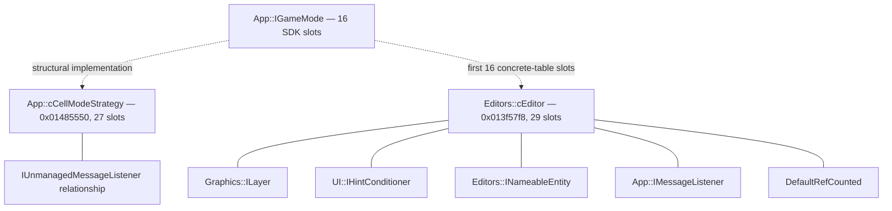

# Class and vtable family atlas

## 1. Scope and authority

This atlas is a readable projection of the validated static type corpus for `SporeApp.exe` 3.1.0.22,
x86:LE:32, image base `0x00400000`, SHA-256
`25d42a7a5c4d438fb155233230f57d29e2849bfdff5c889a5d0847f0469d914e`.
It describes original-binary type, vtable, interface, layout, and lifecycle evidence; it does not describe
current OpenSpore implementation behavior.

The controlling projection is `knowledgegraph/research/type-archaeology.json`. It retains the source artifacts as lossless, conflicting evidence rather than forcing a single hierarchy. The atlas therefore distinguishes:

- a **family**, which may be a header/SDK hierarchy, a shared-slot cluster, or an exact binary prefix relation;
- a **class identity**, which requires stronger corroboration than a scanner label;
- a **slot**, whose status is structural rather than RTTI-backed;
- an **alias**, which is safe only when size, fields, and consumers agree;
- a **candidate**, where ownership or hierarchy remains unresolved.

`SporeApp.exe` has no MSVC RTTI in the supplied corpus. An SDK declaration, adjacent vtable pointer,
shared prefix, or vtable reference can therefore establish a structural relationship, not a unique
original C++ base or derived class. [WA-11] [WA-14] [AUD-19]

### 1.1 Source key

| Key | Source artifact | Atlas use |
|---|---|---|
| CORPUS | [type-archaeology.json](../../knowledgegraph/research/type-archaeology.json) | Final merged corpus, canonical entities, evidence, conflicts, and projections |
| [WA-00](../../knowledgegraph/research/types/00-corpus-inventory.json) | Corpus inventory | Inventory scope, source coverage, and baseline checks |
| [WA-01](../../knowledgegraph/research/types/01-simulator-core.json) | Simulator core | Simulator services, Cell state, pool, and shared globals |
| [WA-02](../../knowledgegraph/research/types/02-gameplay-entity.json) | Gameplay/entity | Cell/entity, mode, creature/tool/editor candidates |
| [WA-03](../../knowledgegraph/research/types/03-creature.json) | Creature | Editor-model, rigblock, animation, and resource structures |
| [WA-04](../../knowledgegraph/research/types/04-world-planet.json) | World/planet | Star/planet records, world graph, terrain, and lifecycle |
| [WA-05](../../knowledgegraph/research/types/05-empire-space.json) | Empire/space | Empire, inventory, mission, communication, and Space records |
| [WA-06](../../knowledgegraph/research/types/06-editor-ui.json) | Editor/UI | Editor, input, App message, UTFWin, and UI families |
| [WA-07](../../knowledgegraph/research/types/07-event-message.json) | Event/message | Event/message values and dispatch lifecycles |
| [WA-08](../../knowledgegraph/research/types/08-persistence-serialization.json) | Persistence | Persistence structures, interfaces, anchors, and gaps |
| [WA-09](../../knowledgegraph/research/types/09-asset-content.json) | Asset/content | Resource records, handles, vtable associations, and lifecycle |
| [WA-10](../../knowledgegraph/research/types/10-managers-registries.json) | Managers/registries | Singleton slots, registries, pools, managers, and lifecycle |
| [WA-11](../../knowledgegraph/research/types/11-vtable-archaeology.json) | Vtable archaeology | High-value tables, I/H/O/U counts, and binary prefix trees |
| [WA-12](../../knowledgegraph/research/types/12-field-archaeology.json) | Field archaeology | Field maps, layout alternatives, and record boundaries |
| [WA-13](../../knowledgegraph/research/types/13-lifecycle.json) | Lifecycle | Static lifecycle boundaries and unresolved transitions |
| [WA-14](../../knowledgegraph/research/types/14-class-families.json) | Class families | Interfaces, common bases, constructors, aliases, and conflicts |
| [WA-15](../../knowledgegraph/research/types/15-reconstruction-relevance.json) | Reconstruction relevance | High-leverage roots, consumer evidence, and non-merge guards |
| [WA-16](../../knowledgegraph/research/types/16-misc-unknown.json) | Miscellaneous/unknown | Remaining types, records, and unresolved ownership evidence |

| Key | Source artifact | Atlas use |
|---|---|---|
| [AUD-17](../../knowledgegraph/research/types/17-audit-integrity.json) | Integrity audit | Artifact integrity, parseability, and evidence provenance |
| [AUD-18](../../knowledgegraph/research/types/18-audit-coverage.json) | Coverage audit | Required-topic, family, and address coverage checks |
| [AUD-19](../../knowledgegraph/research/types/19-audit-conflicts.json) | Conflict audit | Canonical IDs, conflicts, and non-merge decisions |
| [AUD-20](../../knowledgegraph/research/types/20-synthesis-blueprint.json) | Synthesis blueprint | Cross-worker synthesis structure and unresolved dependencies |
| [AUD-21](../../knowledgegraph/research/types/21-report-brief.json) | Report brief | Required report inventory and synthesis priorities |
| [AUD-22](../../knowledgegraph/research/types/22-final-json-audit.json) | Final JSON audit | Final-corpus schema, entity, and conflict checks |
| [AUD-23](../../knowledgegraph/research/types/23-semantic-spotcheck.json) | Semantic spot-check | Cross-artifact semantic agreement and bounded interpretation |

The [Markdown companions](../../knowledgegraph/research/types/) are narrative renderings of the corresponding JSON artifacts.

## 2. Reading and evidence rules

### 2.1 Evidence and confidence

The atlas uses the following bounded labels:

| Label | Meaning in this atlas |
|---|---|
| VERIFIED | Directly byte- or oracle-validated in the cited artifact scope |
| CONFIRMED | Directly confirmed by the source artifact, but not necessarily runtime behavior |
| OBSERVED | Directly present in a committed binary/static export or bounded body |
| SUPPORTED | Multiple static sources agree without hiding a material conflict |
| INFERRED | Structural or semantic interpretation from bounded evidence |
| UNKNOWN | The corpus does not establish the claim |

Confidence is `high`, `medium`, `low`, or `unknown`. It applies to the bounded static contract, not to undocumented runtime behavior. No function-level original runtime validation exists in this corpus. [CORPUS] [WA-11]

### 2.2 Slot accounting

WA-11 defines the structural slot counts used below:

- **Implemented (I):** the target is a function start, either without an explicit base comparison or with a different function-start target from a compared base.
- **Inherited (H):** the raw pointer is identical to the compared base pointer at the same index.
- **Overridden (O):** the target is a function start and differs from the compared base pointer at the same index.
- **Unknown (U):** the target is not a function start; the raw pointer is retained as unknown.

`I/H/O/U` is not a complete ABI. If no explicit base was compared, `H=0` and `O=0` mean “not assessed as inherited/overridden,” not “this class has no base or overrides.” [WA-11]

### 2.3 Constructors, destructors, and lifecycle methods

A vtable slot at position 0 or 1 is not enough to name a constructor or destructor. `Release`, `Dispose`,
`Delete`, and `Close` are lifecycle methods unless a destructor declaration or destructor slot
independently supports that identity. Factory names and return types establish bounded allocation
evidence, not unique runtime dynamic type. [WA-11] [WA-14] [AUD-19]

## 3. Corpus baseline

| Measure | Corpus value | Interpretation |
|---|---:|---|
| Canonical function universe | 58,757 | Frozen triage/xref denominator used by the synthesis |
| Canonical xref edges | 223,704 | Static call/data connectivity, not runtime execution |
| Vtable candidates | 3,081 | Pointer-run candidates, not classes |
| Vtable-reference edges | 11,898 | References to containing table bases, not exact selected slots |
| Data-reference edges | 4,049 | Static data connectivity |
| WA-11 labeled candidates | 20 | Labeled scanner records |
| WA-11 high-value union | 33 | Labels, explicit-chain endpoints, and selected SDK/dossier anchors |
| WA-11 explicit prefix chains | 12 | Six derived tables are related to each of two byte-identical 21-slot bases |
| WA-14 class/interface nodes | 1,250 | Family projection, not unique runtime classes |
| WA-14 class-specific binary matches | 33 | Binary virtual-slot matches attached to class/interface names |
| WA-14 SDK-association-only anchors | 18 | Address-bearing SDK associations without a class-specific slot match |
| WA-14 naming/layout-only families | 1,199 | Low-confidence family nodes |
| WA-14 constructor/destructor records | 278 | Declaration records; binary address availability is sparse |
| WA-14 factory candidates | 18 | Naming/signature/static-call candidates |
| WA-14 preserved contradictions | 2,525 | No contradiction was silently discarded |

These denominators belong to their named artifacts and must not be combined into a synthetic class count. [WA-11] [WA-14]

## 4. High-confidence address-bearing families

“High confidence” below means high confidence in the bounded class/interface association or exact binary structural relation. It does not mean RTTI-backed unique ownership.

### 4.1 App mode and editor dispatch



The edges are SDK/header and vtable-layout relationships. The binary has no RTTI. [WA-06] [WA-11] [WA-14]

#### FAM-APP-CELLMODE — `app.cell-mode-strategy`

- **Addresses and size:** one selected candidate, vtable data VA `0x01485550`, 27 slots.
- **Aliases and base/derived relations:**
  - Canonical corpus ID: `app.cell-mode-strategy`.
  - SDK structure: `App::IGameMode*` at `+0x00` and `App::IUnmanagedMessageListener*` at `+0x04`.
  - WA-14 places it in the seven-member `App::IGameMode` header family.
  - The 16-slot SDK interface and 27-slot concrete table remain different contracts.
- **Slot accounting:** `18 I / 0 H / 0 O / 9 U`; no explicit base comparison was performed for this record.
- **Named function anchors:** ten lifecycle/input/update anchors are independently resolved function starts:

  | Slot | Method | Function VA |
  |---:|---|---:|
  | 6 | `Initialize` | `0x00e81cf0` |
  | 7 | `Dispose` | `0x00e81f30` |
  | 8 | `OnEnter` | `0x00e552f0` |
  | 9 | `OnExit` | `0x00e7fc00` |
  | 11 | `OnKeyDown` | `0x00e818f0` |
  | 12 | `OnMouseMove` | `0x00e51010` |
  | 13 | `OnMouseDown` | `0x00e6c860` |
  | 14 | `OnMouseUp` | `0x00e5c0f0` |
  | 16 | `OnMouseWheel` | `0x00e7d660` |
  | 17 | `Update` | `0x00e80980` |

- **Slot-1 data/interior label:** SDK label `HandleMessage` `0x00e62700` lies inside `FUN_00e62500`; it is not an independently resolved slot-1 function target. Slot 15 and the other unknown slots are not assigned a method name.
- **Constructor/destructor:** no concrete constructor is resolved. `Dispose` is lifecycle, not a proven destructor.
- **Key consumers:** table-base references from `0x00e61550` and `0x00e616c0`; the mode registry and Cell
  lifecycle consume the same contract. The raw table also appears in an `Editors::cEditor` projection
  because of shared pointer-run evidence; that conflict is preserved.
- **Evidence:** HIGH_STATIC family confidence; high identity confidence in the bounded Cell-mode association.
- **Semantic subsystem:** application mode lifecycle, input routing, Cell stage activation, update, exit, and disposal.
- **Reconstruction relevance:** highest-value mode boundary because it has ten named function anchors,
  one SDK slot-1 data label, two table consumers, and a bounded
  initialize→enter→update→exit→dispose sequence. The remaining nine unknown slots and the separate
  16-slot interface/base ABI prevent treating the table as complete.
  [WA-02] [WA-06] [WA-07] [WA-11] [WA-14]

#### FAM-EDITORS-CEDITOR — `app.ceditor`

- **Addresses and size:** vtable data VA `0x013f57f8`, 29 slots; object size 1,536 bytes / `0x600`.
- **Aliases and base/derived relations:** canonical corpus ID `app.ceditor`.
  - The 1,536-byte structure has six adjacent vptrs: `IGameMode`, `ILayer`, `IHintConditioner`,
    `INameableEntity`, `IMessageListener`, and `DefaultRefCounted`.
  - The first 16 concrete slots align with the SDK `IGameMode` order; slots 16–28 are
    additional/adjacent virtuals.
- **Slot accounting:** `24 I / 0 H / 0 O / 5 U`; unknown indices 6, 16, 17, 22, and 24 in the WA-11 record. The six adjacent interface/base relationships are structural layout evidence, not inherited-slot accounting.
- **Named slots and function anchors:**

  | Slot | Identity | VA |
  |---:|---|---:|
  | 0–3 | SDK refcount/dtor/Cast prefix | prefix, not individually selected here |
  | 4 | `Initialize` | `0x00584300` |
  | 5 | `Dispose` | `0x00576c50` |
  | 7 | `OnExit` | `0x00587a20` |
  | 9 | `OnKeyDown` | `0x0058ac10` |
  | 10 | `OnKeyUp` | `0x00585890` |
  | 11 | `OnMouseDown` | `0x00588570` |
  | 12 | `OnMouseUp` | `0x0058b650` |
  | 13 | `OnMouseMove` | `0x005737d0` |
  | 14 | `OnMouseWheel` | `0x00585d10` |
  | 15 | `Update` | `0x0058be50` |

  The table’s raw slot targets and SDK labels remain separate where function boundaries were repaired.
- **Constructor/destructor:** exact Itanium-style constructor symbol at `0x0057ce80` writes
  `0x013f57f8` and five additional vtable addresses; its sole direct caller in the frozen xref
  snapshot is `0x0057f3e0`. `Dispose` is not treated as a destructor.
- **Key consumers:** six unique WA-11 table-base consumer VAs:
  `0x00579e20`, `0x0057a6d0`, `0x0057ce80`, `0x00e642a0`, `0x00ed8a30`, and `0x00fffdd0`.
  Named consumers include `AddCreature` `0x00582fe0`, `SetEditorModel` `0x00586b00`,
  `HandleMessage` `0x00591fa0`, and `CommitEditHistory` `0x00586410`.
- **Evidence:** HIGH_STATIC family confidence; high bounded identity confidence from SDK layout, constructor vtable stores, and named methods.
- **Semantic subsystem:** editor root, mode/layer participation, model/rigblock editing, history, UI, animation bridge, and renderer-service composition.
- **Reconstruction relevance:** strongest editor root boundary. Preserve the six-interface object shape and first 16 mode slots; do not relabel the 29-slot table as a 29-slot `IGameMode`. [WA-03] [WA-06] [WA-11] [WA-14]

### 4.2 Property store family

#### FAM-APP-PROPERTY — `app.property-list` and `app.direct-property-list`

- **Addresses and size:** `App::PropertyList` vtable `0x01408820`, 19 slots; `App::DirectPropertyList` vtable `0x01408870`, 19 slots. The `PropertyList` object is 56 bytes / `0x38`.
- **Aliases and relationships:** this is a shared-slot/storage family, not a forced identity merge.
  WA-14’s header projection places `DirectPropertyList` below `PropertyList`; AUD-19 retains them
  as separate entities because `DirectPropertyList` is a storage specialization and the `Property`
  value record has a separate layout dimension.
- **Slot accounting:** both tables are `19 I / 0 H / 0 O / 0 U`. No base comparison was performed, so override status is unknown.
- **Slots:** property lookup, enumeration, copy/clear, add/remove, and `Read`/`Write` are resolved by SDK method anchors. `PropertyList::Read` is `0x006a2f60`; `Write` is `0x006a1540`; `GetProperty` `0x006a2530`; `SetProperty` `0x006a2e20`.
- **Constructor/destructor:** no resolved binary constructor or destructor. The two vtables do not establish one.
- **Key consumers:** two unique table consumers per WA-11 record. Property-bearing systems include planet, terrain, weather, editor, and persistence records, but exact field sets and `.prop` wire order remain unresolved.
- **Evidence:** MEDIUM_STATIC family confidence; high confidence in each individual SDK-associated vtable and 19-slot layout.
- **Semantic subsystem:** property definition, property lookup, inheritance/parent overlay, and property persistence.
- **Reconstruction relevance:** preserve the value/store distinction, recursive parent lookup, and 19-operation surface. Do not select either conflicting `App::Property` layout as a wire contract. [WA-08] [WA-09] [WA-11] [AUD-19]

### 4.3 Tool strategy family

#### FAM-SIMULATOR-TOOL — `Simulator::cToolStrategy`

- **Family size and fan-out:** WA-11 selects three representative tables. WA-14’s SDK-associated
  list contains 20 concrete candidate VAs, while the broader header projection lists 64 class-specific
  binary vtable addresses with 13 derived header types. These scopes are not interchangeable.
- **Base/interface relation:** SDK bases are `Object` and `DefaultRefCounted`; the SDK contract has 18 slots. Header-derived variants include AOE, beam, projectile, scan, repair, placement, and cargo strategies.
- **Representative slot accounting:**

  | VA | Slots | I/H/O/U | Notes |
  |---|---:|---|---|
  | `0x01442324` | 28 | `0/21/3/4` | Exact 21-slot prefix match; also carries `Simulator::cToolStrategy::OnSelect` `0x01053790` and UTFWin allocator/new anchors |
  | `0x014624d0` | 40 | `10/0/0/30` | `OnSelect` is the sole named SDK association in WA-11 |
  | `0x0149b4d8` | 40 | `20/0/0/20` | `OnSelect` plus a larger tool-specific function cluster |

- **SDK method labels and function boundaries:**

  | SDK label | Label VA | Containing function VA | Boundary status |
  |---|---:|---:|---|
  | `GetAimPoint` | `0x01052f10` | `0x01052f00` | absorbed interior label |
  | `OnHit` | `0x010593b0` | `0x01059170` | absorbed interior label |
  | `OnMouseUp` | `0x01053660` | `0x010535e0` | absorbed interior label |
  | `SelectedUpdate` | `0x01053b60` | `0x01053980` | absorbed interior label |
  | `Update` | `0x01056130` | `0x01055890` | absorbed interior label |
  | `WhileAiming` | `0x01053930` | `0x010537e0` | absorbed interior label |
  | `WhileFiring` | `0x01056880` | `0x01056160` | absorbed interior label |

  `OnSelect` `0x01053790` is the additional resolved method anchor. The seven label VAs are not
  independent function starts, and none should be used as an exact slot target. Exact slot positions
  belong to the selected table, not to every derived variant. [WA-14]
- **Constructor/destructor:** no family-wide concrete constructor or destructor is resolved.
- **Key consumers:** `cToolManager` registry at `+0x38`; representative table consumers include
  `0x00b60d80` and `0x01055890`. Named tool consumers also include
  `cDefaultAoETool::OnMouseDown` `0x01052f90`, `cDefaultBeamTool::func4Ch` `0x01053db0`, and
  `cGetOutOfUFOToolStrategy::OnSelect` `0x01054080`.
- **Evidence:** HIGH_STATIC family confidence for the SDK-associated tool cluster; medium confidence for any single concrete owner where only one method anchor is present.
- **Semantic subsystem:** tool selection, aiming, firing, hit handling, update, and strategy registration.
- **Reconstruction relevance:** preserve the 18-slot strategy contract and registry keying before
  specializing variants. The `0x01442324` prefix is useful but also demonstrates why a shared prefix
  does not establish a unique class hierarchy. [WA-02] [WA-10] [WA-11] [WA-14]

### 4.4 Packed-file record family

#### FAM-RESOURCE-PFRECORD — `Resource::PFRecordRead` / `Resource::PFRecordWrite`

- **Family size and addresses:** WA-14 identifies `PFRecordRead` candidates `0x0140a328` and
  `0x014368c4`. `PFRecordWrite` candidates are `0x0140a328`, `0x014368c4`, `0x01436954`, and
  `0x01481940`. Shared addresses preserve overlap rather than selecting a unique owner.
- **Base/derived relations:** SDK/header structure places `PFRecordRead` and `PFRecordWrite` below `PFRecordBase`, then `IRecord`, `ThreadedObject`, and `EAIOZoneObject`. This is header/layout evidence.
- **Representative slot accounting:** selected `0x014368c4` is a 40-slot candidate with
  `22 I / 0 H / 0 O / 18 U`. It mixes `PFRecordRead::ReadData`, `PFRecordWrite::GetAvailable`, and
  `PFRecordWrite::GetType` anchors. WA-09 separately records the 26-slot family around `0x0140a328`.
- **Constructor/destructor:** WA-14 records declared constructor/destructor pairs for the read/write
  record classes, but no exact binary constructor/destructor pair is pinned in this atlas. `ReadData`
  and write-state methods are not destructors.
- **Key consumers:** six table-base consumers for `0x014368c4`:
  `0x008dcc80`, `0x008dcd70`, `0x008dcdc0`, `0x008dcea0`, `0x008dd0d0`, and `0x008dd1f0`.
  Resource manager, database, index, and packed-record paths are the semantic consumer cluster.
- **Evidence:** HIGH_STATIC family confidence; high confidence in mixed read/write SDK anchors, medium confidence in exact concrete table ownership.
- **Semantic subsystem:** record reading/writing, stream extents, packed-file state, and database access.
- **Reconstruction relevance:** preserve read/write capability separation and record metadata, but do not use a shared pointer run as proof that one object is simultaneously a read and write record. [WA-08] [WA-09] [WA-11] [WA-14]

### 4.5 ArgScript parser family

#### FAM-ARGSCRIPT-FORMAT — `ArgScript::FormatParser`

- **Address and size:** vtable data VA `0x0141c930`, 40-slot candidate; SDK structure size 448 bytes.
- **Base/derived relations:** no explicit base is established in WA-14. The parser is structurally connected to the broader ArgScript parser/command vocabulary by SDK methods and layout, not by a recovered concrete hierarchy.
- **Slot accounting:** `25 I / 0 H / 0 O / 15 U`; unknown indices 1, 4–10, 25, 26, 30, 31, 33, 35, and 39.
- **Named slots:** `GetCurrentScope`, `ParseFloat`, `ParseUInt`, and `Release` are resolved SDK anchors.
- **Additional absorbed SDK labels:**

  | SDK label | Label VA | Containing function VA |
  |---|---:|---:|
  | `Initialize` | `0x00845790` | `0x008456e0` |
  | `AddBlock` | `0x00845390` | `0x00845370` |
  | `Close` | `0x00844f70` | `0x00844ec0` |
  | `Dispose` | `0x00846e60` | `0x00846db0` |
  | `GetParser` | `0x00842cc0` | `0x00842c60` |

  These five values are interior SDK labels, not independent named entry points or exact function starts. [WA-14]
- **Constructor/destructor:** no exact constructor/destructor pair. `Release`, `Close`, and `Dispose` are lifecycle methods, not proven destructors.
- **Key consumers:** `0x00847200` and `0x00847490` reference the table base. The function cluster also reaches parser, lexer, definition, block, and variable operations.
- **Evidence:** HIGH_STATIC family confidence; high confidence in the bounded FormatParser identity, medium confidence in the complete table boundary.
- **Semantic subsystem:** script parsing, scope, definitions, variables, blocks, and typed scalar parsing.
- **Reconstruction relevance:** useful as a discrete parser contract; it must remain separate from UI commands, process command-line parsing, and creature action commands. [WA-07] [WA-11] [WA-14]

### 4.6 Corroborated application and resource service candidates

These families have strong SDK/layout/address evidence in WA-06, WA-09, WA-10, and WA-14, but were not part of the WA-11 high-value 33-record set. WA-11 I/H/O/U counts therefore remain unavailable rather than inferred.

- **`App::cMessageManager`**
  - Binary/interface evidence: candidate `0x01445cb8`; `IMessageManager` has 19 slots; object size is `0xc8`.
  - Relation/boundary: implements the message-manager interface contract; global accessor `0x0067dc80` reads slot `0x015fd8dc`.
  - Lifecycle/consumers: `ProcessQueue` `0x008841f0`; listener registry at `+0x70`.
  - Evidence/relevance: SUPPORTED, high; central message-routing and payload-lifetime boundary. [WA-06] [WA-07] [WA-10]
- **`App::cGameModeManager`**
  - Binary/interface evidence: candidate `0x01412598`; `IGameModeManager` relation; 52-byte registry and 23-slot candidate.
  - Relation/boundary: distinct from the 156-byte `Simulator::cGameModeManager`; accessor `0x0067dcd0`.
  - Lifecycle/consumers: `ModeEntry` vector at `+0x14`; active index at `+0x28`.
  - Evidence/relevance: SUPPORTED, high; mode registry boundary. [WA-06] [WA-10] [AUD-19]
- **`App::cPropManager`**
  - Binary/interface evidence: candidates `0x014091a0` and `0x014091e8`; object size `0x1ec`.
  - Relation/boundary: `IPropManager` implementation with a WA-14 resource-factory relation; concrete slot count is not normalized.
  - Lifecycle/consumers: accessor `0x0067ddf0` reads slot `0x015fd8f0`; property registry at `+0x74`.
  - Evidence/relevance: SUPPORTED, high; property definition/list materialization boundary. [WA-10] [WA-14]
- **`Resource::cResourceManager`**
  - Binary/interface evidence: candidate `0x01436ae8`; `IResourceManager` has 38 slots; object size is `0x178`.
  - Relation/boundary: `IResourceManager` implementation.
  - Lifecycle/consumers: `Initialize` `0x008de530`; factory map at `+0x30`; type maps, cache, and allocator.
  - Evidence/relevance: SUPPORTED, high; resource identity, factory, cache, and database seam. [WA-08] [WA-09] [WA-10]
- **`ISimulatorStrategy` implementations**
  - Binary/interface evidence: `cSimulatorSystem`, noun/star/tool/comm strategy relationships; no uniquely installed interface address.
  - Relation/boundary: shared simulator strategy interface; `cSimulatorSystem+0x5c` stores intrusive strategy pointers.
  - Lifecycle/consumers: simulator composition/update boundary; manager insertion order remains unresolved.
  - Evidence/relevance: SUPPORTED for the structural family, medium for each concrete owner. [WA-01] [WA-10]

## 5. Candidate families and ambiguous groupings

### 5.1 App application-system candidate

#### FAM-APP-CAPPSYSTEM

- **VA/slots:** `0x01413acc`, 40 slots; `18 I / 0 H / 0 O / 22 U`.
- **Anchors:** `App::cAppSystem::HookWindows`, `InitPlugins`, and `Unpause`.
- **Consumers:** `0x007e7630` and `0x007e78d0`.
- **Factory boundary:** SDK label `cAppSystem::Create` `0x007e8a00` is an interior label inside `FUN_007e89c0`, not an independently resolved factory function. WA-14 reports no committed inbound callers for the containing function.
- **Lifecycle:** no exact constructor/destructor pair; `Create` remains only a factory-candidate identity. [WA-14]
- **Evidence:** MEDIUM_STATIC; high table-structure confidence, medium class-ownership confidence.
- **Subsystem/relevance:** application bootstrap and plugin/window hooks. Useful as a service boundary, but not a resolved inheritance root. [WA-11] [WA-14]

### 5.2 EditorModel alternatives

#### FAM-EDITORS-EDITOR-MODEL — `editors.editor-model`

- **Canonical identity:** `editors.editor-model`, 224-byte object. This canonical ID indexes the model/layout identity; it does not choose a vtable base.
- **Address alternatives:** object-start/scanner candidates include `0x013ef110`, `0x013f2194`,
  `0x013f21d8`, `0x013f276c`, `0x013f2d68`, `0x01458024`, and `0x01458788`.
  WA-11 selects `0x013f2194`; AUD-19 names the first five as the principal unresolved alternatives.
- **Selected slot accounting:** `0x013f2194` is 40 slots with `39 I / 0 H / 0 O / 1 U`; unknown slot 0.
- **Slot/interface anchors:** `EditorModel::SetColor` `0x004ae250`; the object begins with `INameableEntity` and `IVirtual` vptrs and has a refcount/ResourceKey/rigblock layout.
- **Constructor/destructor:** exact model constructor is unresolved. WA-03 records repaired `Dispose`
  at `0x004ad6f0`, while WA-06 records `0x004ad850`; both are lifecycle boundaries, not a resolved
  destructor pair. Contained `Load` `0x004ae8d0` and `Save` `0x004af780` remain inside larger
  function boundaries.
- **Consumers:** 32 unique table consumers for the selected record; key semantic consumers are `cEditor::SetEditorModel` `0x00586b00`, history, and rigblock hierarchy.
- **Evidence:** MEDIUM_STATIC family confidence; high canonical layout identity, low/medium confidence in any one vtable base.
- **Subsystem/relevance:** editor document/model boundary. Preserve the object as an indexed entity while retaining every vtable alternative. [WA-03] [WA-06] [WA-11] [AUD-19]

### 5.3 IO stream family

#### FAM-IO-STREAM

- **Selected VA/slots:** `0x0143eaac`, 40 slots, `22 I / 0 H / 0 O / 18 U`.
- **Anchors:** `IO::StreamBuffer::GetAvailable`, `IO::StreamChild::GetAvailable`, and `StreamChild_Close`.
- **Broader family:** WA-14’s `IO::IStream` header family has 10 direct children.
  Address-bearing members include:
  - `FileStream`: `0x01436678`, `0x0143ca40`, `0x0143e670`, `0x0143fe78`.
  - `FixedMemoryStream`: `0x0143eafc`, `0x0143eb4c`.
  - `StreamBuffer`: `0x0143eaac`.
  - `StreamChild`: `0x0143eaac`, `0x0143eafc`.
- **Constructor/destructor:** declared `IO::FileStream` constructor/destructor pair exists, but no exact pair is promoted here. `Close` is lifecycle.
- **Consumers:** `0x0093b530`, `0x0093b5a0`, `0x0093b7d0` for the selected table; packed-file records and resource streams are broader consumers.
- **Evidence:** MEDIUM_STATIC family confidence; high table-structure confidence.
- **Subsystem/relevance:** stream capability and record/database transport. Shared addresses between `StreamBuffer` and `StreamChild` preserve ambiguity rather than selecting a canonical table. [WA-08] [WA-09] [WA-11] [WA-14]

### 5.4 UTFWin 21-slot prefix family

#### FAM-UTFWIN-UTFWINOBJECT-21

This is the strongest exact binary prefix relation, but the two roots are byte-identical and neither is canonical.

```text
0x013fa974 [21 slots, ambiguous owner] ─┐
                                       ├─> 0x013fa794 [30 slots; 21 shared; 3 overridden; 6 unknown]
0x01419794 [21 slots, ambiguous owner] ─┘
                                       ├─> 0x013fef9c [24 slots; 21 shared; 0 overridden; 3 unknown]
                                       ├─> 0x0141a024 [26 slots; 21 shared; 2 overridden; 3 unknown]
                                       ├─> 0x01442324 [28 slots; 21 shared; 3 overridden; 4 unknown]
                                       ├─> 0x01442604 [24 slots; 21 shared; 3 overridden; 0 unknown]
                                       └─> 0x014434fc [24 slots; 21 shared; 3 overridden; 0 unknown]
```

- **Family size/fan-out:** 8 tables total, 2 identical candidate bases, 6 derived candidates under each base in the scanner output. WA-11 records 12 explicit chain edges because both bases relate to every derived table.
- **Base slot accounting:** each base is `18 I / 0 H / 0 O / 3 U`; unknown indices 7, 9, and 10.
- **Anchors:** recurring `UTFWin::UTFWinObject::new_` `0x00951230` and `UTFWin::GetAllocator` `0x00951220`; these are allocation scaffolding, not a resolved constructor/destructor contract.
- **Consumers:** the selected base/derived records have no unique table consumers in WA-11.
- **Evidence:** MEDIUM_STATIC with high confidence in exact 21-slot prefix equality; medium confidence in class ownership.
- **Subsystem/relevance:** UTFWin object/window infrastructure. Preserve both roots and the raw table graph; do not invent a canonical base or language inheritance. [WA-06] [WA-11] [WA-14] [AUD-19]

### 5.5 UTFWin Window 40-slot cluster

#### FAM-UTFWIN-WINDOW-40

- **Family size:** WA-11 has 15 class-specific Window candidate anchors; the broader WA-14
  `UTFWin::Window` address-bearing projection contains 123 candidate VAs.
  Selected WA-11 members are `0x01414ed4`, `0x0141873c`, `0x01418838`, `0x014190d4`,
  `0x014191d0`, `0x0141930c`, `0x014195ac`, `0x0141ab94`, and `0x01441144`.
- **Fan-out:** WA-14’s header family lists `UI::Minimap`, `UTFWin::InteractiveWindow`, and `UTFWin::SporeAnimatedIconWin`; none has a class-specific binary match in the WA-14 tree.
- **Representative slot accounting:** most selected records are 40 slots with `32 I / 0 H / 0 O / 8 U`; `0x01418838` is also `32/0/0/8`; `0x014191d0` is `34/0/0/6`.
- **Anchors:** `Window::GetCursorID`, `GetDrawable`, `IsAncestorOf`, `func35`, `GetRealArea`, `SetCommandID`, and `SetTextFontID`, depending on the candidate.
- **Cross-namespace conflict:** seven selected Window-family candidates also carry `Sporepedia::cSPAssetDataOTDB::HasName`. This is candidate contamination, not a UTFWin-to-Sporepedia hierarchy.
- **Constructor/destructor:** WA-14 records a declared `UTFWin::Window` constructor/destructor pair, but the concrete class-specific address and slot owner are not selected here. `UTFWinObject::new_` is generic scaffolding.
- **Consumers:** most selected candidates have zero unique table consumers; `0x01418838` has 15 and `0x01441144` has 1. Stronger semantic consumers are UTFWin layouts, EditorUI/PlayModeUI, controls, renderer/painter, and pdtk text paths.
- **Evidence:** MEDIUM_STATIC cluster confidence; high confidence in UTFWin method anchors, low confidence in a single 40-slot class boundary.
- **Subsystem/relevance:** window tree, IDs, geometry, drawable, layout, children, and message routing. Preserve `UI::Window` as a separate opaque constructor-labeled entity. [WA-06] [WA-07] [WA-11] [AUD-19]

### 5.6 Sporepedia asset metadata candidate

#### FAM-SPORPEDIA-ASSET

- **Family size:** anchor `0x013ff648`; WA-11 selected members are `0x013ff648`, `0x01414ed4`, `0x0141873c`, `0x014190d4`, `0x0141930c`, `0x014195ac`, `0x0141ab94`, `0x01441144`, and `0x01490be8`.
- **Selected slot accounting:** `0x013ff648` is 40 slots with `29 I / 0 H / 0 O / 11 U`; unknown indices 1, 6, 7, 10, 17–19, 21, 26, 31, and 37.
- **Anchors:** `GetAssetID`, `GetAuthorID`, `GetAuthorName`, `GetTags`, `GetTimeCreated`, `HasName`, `IsEditable`, and two unnamed `cSPAssetDataOTDB` functions.
- **Constructor/destructor:** no exact binary constructor/destructor is resolved.
- **Consumers:** `0x00642100`, `0x00642190`, and `0x00ecc680` for the anchor.
- **Conflict:** seven Window-family tables overlap this family through `HasName`; `0x01490be8` is also the disputed Terrain candidate. These overlaps are preserved and are not inheritance evidence.
- **Evidence:** HIGH_STATIC family confidence for the anchor, medium confidence for broader membership because of cross-namespace contamination.
- **Subsystem/relevance:** local asset metadata queries and Sporepedia/Pollinator boundary. Online request/response lifecycle remains unresolved. [WA-09] [WA-11] [WA-14] [AUD-19]

### 5.7 Terrain sphere candidate

#### FAM-TERRAIN-SPHERE — `terrain.c-terrain-sphere`

- **Address and slots:** `0x01490be8`, 40-slot scanner candidate, `17 I / 0 H / 0 O / 23 U`.
- **Terrain anchors:** `Terrain::cTerrainSphere::GetSimDataRTT` is recorded at slot 37 by WA-04; the method entry is `0x00f968b0`.
- **Conflict:** a decomp-gap projection associates the same table with `Sporepedia::cSPAssetDataOTDB`; WA-11 also records a `HasName` association. AUD-19 selects no unique owner.
- **Interface relation:** SDK layout gives `cTerrainSphere` `ITerrain`, `ILayer`, `IMessageListener`,
  `IAmbientOccluder`, and `ResourceObject` relations. The SDK `ITerrain` count is 74 in one export
  and 75 in WA-09; neither equals the 40-slot scanner run.
- **Factory/destructor boundary:** SDK label `cTerrainSphere::Create` `0x00fa2350` is an interior
  label inside `FUN_00fa1bc0`, not an independently resolved factory function. No exact destructor
  is resolved; `Dispose`/asset-unload methods are lifecycle and interface operations. [WA-14]
- **Consumers:** `0x00fa0780`, `0x00fa1bc0`; semantic consumers are `cPlanetModel`, planet surface queries, terrain sphere/quad passes, and resource loading.
- **Evidence:** HIGH_STATIC table confidence, low/medium class-ownership confidence because of the Sporepedia conflict.
- **Subsystem/relevance:** terrain maps, quads, textures, weather/state links, and rendering. Preserve the interface, candidate table, and conflict as separate dimensions. [WA-04] [WA-09] [WA-11] [AUD-19]

### 5.8 Unattributed 40-slot family

#### FAM-UNATTRIBUTED-40 — `unknown.vtable.013f1a30`

- **Address and slots:** `0x013f1a30`, 40 slots, `38 I / 0 H / 0 O / 2 U`; unknown slots 0 and 10.
- **Anchors:** 17 unnamed function starts, including `purecall`; no class-specific SDK association.
- **Constructor/destructor:** unresolved; no slot position is used to infer a destructor.
- **Consumers:** 71 unique table consumers, making it structurally important but not class-identifiable.
- **Evidence:** MEDIUM_STATIC candidate confidence; high table-structure confidence, low identity confidence.
- **Subsystem/relevance:** unknown. Fan-in does not establish ownership, namespace, or subsystem. [WA-11] [WA-14] [AUD-19]

## 6. Cross-family inheritance and common-base summary

### 6.1 Header/SDK common bases

The following fan-out counts come from WA-14’s header/SDK family projection. They do not prove binary C++ inheritance.

- **Reference and identity vocabulary**
  - `DefaultRefCounted` — 92 direct derived records, including `cEditor`, `EditorModel`, `cGameData`, UI, and UTFWin classes. This is broad interface/embedded-base vocabulary, not one binary base.
  - `Simulator::cGameData` — 44 direct derived records, including `cEmpire`, `cPlayer`, `cMission`, `cPlanet`, `cStar`, `cVehicle`, projectiles, ornaments, and buildings. AUD-19 keeps the concrete records separate.
  - `Object` — 34 direct derived records across cameras, resource/database types, editor rigblocks, and serializer streams. This is root SDK layout vocabulary.
  - `IVirtual` — 25 direct derived records across camera, editor, simulator, graphics, and strategy classes.
  - `RefCountTemplate` / atomic variant — 19 / 5 direct derived records, primarily empire, record, and manager-like objects.
- **Messaging and UI interfaces**
  - `App::IUnmanagedMessageListener` — 21 direct derived records spanning modes, input, managers, editor, and gameplay records.
  - `UTFWin::IWinProc` — 29 direct derived records spanning editor/play UI, interactive procs, palette, and controls.
  - `App::IGameMode` — 7 direct derived records: default, Space, Cell, scenario, creature, and editor modes. Cell’s 27-slot table is not a universal interface ABI.
- **Simulator domain interfaces**
  - `Simulator::ISimulatorSerializable` — 15 direct derived records spanning star, planet, empire, mission, Cell serializable, and simulator roots; not a universal event/persistence ABI.
  - `Resource::ResourceObject` — 13 direct derived records spanning Cell resource, terrain, creature-data, and RenderWare resource records.
  - `Simulator::cToolStrategy` — 13 direct derived records spanning beam, AOE, repair, placement, scan, projectile, and cargo tools; individual bases remain bounded.
  - `Simulator::cSpaceInventoryItem` — 4 direct derived records: animal cargo, plant cargo, object-instance inventory, and space tool. The shared-prefix conflict remains.
- **Bounded specializations**
  - `App::PropertyList` — 1 direct derived record, `DirectPropertyList`; retain the header relation without merging the storage specialization.
  - `Editors::EditorModel` alternatives — one base-candidate group with `INameableEntity` / `IVirtual`; multiple candidate table addresses remain and no canonical base is selected.

The strongest binary common-base evidence remains the UTFWin 21-slot pair described in section 5.4. Exact shared prefixes are stronger than generic naming, but the two roots remain duplicate candidates. [WA-14] [AUD-19]

### 6.2 Structural families that must not be promoted to inheritance

```text
cGameData identity/prefix family
├─ cEmpire
├─ cPlayer
├─ cMission
├─ cPlanet / cVisiblePlanet
├─ cStar
├─ cVehicle / cGameDataUFO
├─ projectile, building, ornament, and tool records
└─ other SDK records with repeated identity fields
```

- The recurring fields include refcount/list links, game-data ID, definition ID, owner, political ID, and serializer/refcount interface relations.
- AUD-19 classifies this as `sim.cgame-data-derived`, a structural prefix family.
- `cEmpire` is a 344-byte concrete entity and is not a synonym for the 52-byte `cGameData` base. [WA-01] [WA-02] [WA-05] [AUD-19]

```text
cSpaceInventoryItem storage/interface family
├─ cAnimalCargoInfo
├─ cPlantCargoInfo
├─ cObjectInstanceInventoryItem
└─ cSpaceToolData
```

- The shared inventory/tool/cargo prefix is useful for field grouping.
- The prefix is not a universal type identity, and AUD-19 retains the `cSpaceInventoryItem` layout conflict. [WA-05] [AUD-19]

```text
cCreatureBase layout-prefix family
├─ cCreatureAnimal
└─ cCreatureCitizen
```

- `cCreatureBase` is 4,032 bytes / `0xfc0`; `cCreatureAnimal` is 5,792 bytes / `0x16a0`.
- WA-03 supports a repeated layout prefix; WA-02 and AUD-19 retain the absence of binary C++ inheritance proof. [WA-02] [WA-03] [AUD-19]

## 7. Major non-polymorphic structure clusters

These clusters are important even when no class-specific vtable is resolved. “Non-polymorphic” here
means the recovered contract is dominated by records, values, state blocks, or metadata; it does not
assert that every member has zero virtual interfaces.

### 7.1 Cell runtime state

- **`Simulator::Cell::sCellGame` / `cCellGame` — 20,964 bytes**
  - Canonical relationship: `sim.cell-game-state`; aliases are merged.
  - Fields/boundary: main pool at `+0x1c`; query references around `+0x40fc/+0x4100`; world references around `+0x4114/+0x4118`; avatar index around `+0x411c`; later timing/state fields.
  - Lifecycle: mode initialize, create/update, mode exit, and dispose.
  - Evidence: SUPPORTED, high; preserve pool-index identity, world/query references, timing gates, and serialization boundary. [WA-01] [WA-02] [AUD-19]
- **`cCellObjectData` — 920 bytes**
  - Canonical relationship: `sim.cell-object-data`; pooled entity.
  - Fields/boundary: first word is a free-list link or self index, followed by target transform, model/resource, health, GFX, scale, and query fields.
  - Lifecycle: create, move, release/rebuild, and deallocate.
  - Evidence: SUPPORTED, high; strongest pooled gameplay record. [WA-01] [WA-02] [AUD-19]
- **`cObjectPool<cCellObjectData>` — 28-byte manager**
  - Canonical relationship: `sim.cell-object-pool`; specialization of the generic pool family.
  - Fields/boundary: buffer, free head, ID, capacity, live count, and stride.
  - Lifecycle: stage-owned pool with 4,096 capacity and 920-byte stride.
  - Evidence: CONFIRMED static mechanics, high; do not import generic pool behavior without adjudication. [WA-01] [WA-10] [AUD-19]
- **`cCellQueryEntry` — 28 bytes**
  - Relationship: separate from linked-pool data/header records.
  - Fields/boundary: position, size, next link at `+0x14`, and Cell index.
  - Consumers: spatial-query paths.
  - Evidence: SUPPORTED, high; preserve stable pool-index linkage. [WA-02] [AUD-19]
- **`cCellDataReference_` / typed variants — 16 bytes**
  - Relationship: shared Cell data-reference family.
  - Fields/boundary: instance ID, serializer, intrusive resource, and counter.
  - Lifecycle: `Create` `0x00e82420`; `0x00e82340` remains an adjacent unresolved anchor.
  - Evidence: SUPPORTED layout, medium identity; preserve the resource handle and alias gap. [WA-02] [WA-09] [WA-14]
- **`cCellSerializableData` — 236 bytes**
  - Relationship: separate from Cell resource records.
  - Fields/boundary: progression, parts, counters, game time, missions, and telemetry-like flags.
  - Lifecycle: save/load or state-restoration boundary.
  - Evidence: SUPPORTED layout, medium lifecycle; not a Cell resource envelope. [WA-02] [WA-08] [AUD-19]

### 7.2 Persistent world and Space records

- **Persistent primary records**
  - `cStarRecord` — 176-byte serializable/refcount record. Saved-game version/time, position/type/technology, empire, species, and planet-record vector. SUPPORTED, high; persistent star identity and generated planets. [WA-04] [WA-05]
  - `cPlanetRecord` — 432-byte `ResourceObject`-backed record. Orbit, planet scores, species,
    commodity/civ/tribe collections, and terrain/spice keys. SUPPORTED, high with the
    `mCivData` / `mTribeData` offset conflict; highest-value data-first boundary.
    [WA-04] [WA-05] [AUD-19]
- **Embedded planet subrecords**
  - `cCivData` — 80 bytes; civilization state. SUPPORTED, medium; keep nested in the planet record.
  - `cTribeData` — 24 bytes; political ID, position, population, and food. SUPPORTED, medium; keep nested in the planet record.
  - `cCommodityNodeData` — 8 bytes; owner political ID and mine state. SUPPORTED, high; economy-state primitive.
- **Cross-stage and save subrecords**
  - `SpacePlayerData` / `sSpacePlayerData` — 52 bytes; canonical `sim.cspace-player-data`.
    Active planet/star, relationships, context, empire ID/cache, and colonies. CONFIRMED static,
    high; preserve the lazy empire identity/cache boundary. [WA-04] [WA-05] [AUD-19]
  - `PlayerPlanetData` / `cSpacePlayerWarData` / `cSpaceTradeRouteManager` — 104 / 64 / 36 bytes; serializable mission, war, and trade substate. SUPPORTED, medium; do not merge into a universal save record. [WA-05]

### 7.3 Editor document, animation, and resource records

- **Document and edit hierarchy**
  - `Editors::EditorModel` — 224 bytes; vtable-bearing document with multiple candidate bases. ResourceKey, rigblocks, model type, names, colors, and bounding boxes. SUPPORTED layout, medium vtable ownership. [WA-03] [WA-06]
  - `Editors::EditorRigblock` — 3,592 bytes; part/edit object. Model/world links, hierarchy, transforms, handles, and parent. SUPPORTED layout, medium mechanics. [WA-03] [WA-06]
  - `Editors::cEditorResource` — 172 bytes; history/resource record hypothesis. ResourceKey, properties, and block vector. SUPPORTED layout, medium family pairing. [WA-03] [WA-06]
  - `Editors::cEditorResourceBlock` — 472 bytes; serialized hierarchy block. Hierarchy, transforms, limbs, muscles, and paint. SUPPORTED layout. [WA-03]
  - `Editors::cCreatureDataResource` — 296 bytes; `ResourceObject`-backed record. Properties, compact rigblocks, capabilities, animations, and effects. SUPPORTED layout, medium codec. [WA-03] [WA-08]
- **Animation and runtime state**
  - `Anim::CreatureBlock` — 1,128 bytes; animation hierarchy record. Names, IDs, transforms, capabilities, and parent/deform data. SUPPORTED layout, medium runtime ownership. [WA-03]
  - `Editors::EditorCreatureController` — 136 bytes; refcounted controller. AnimatedCreature/model world, target/current position and angle, movement/look speeds. SUPPORTED, high static layout. [WA-03] [WA-06]
  - `Editors::cEditorAnimWorld` — 72 bytes; controller/event owner. Creature-ID map, event vector, and animation/model worlds. SUPPORTED, high; clearest create→update→destroy boundary. [WA-03] [WA-06]
  - `Editors::cEditorAnimEvent` — 48 bytes; `IMessageRC` + refcount runtime event.
    Editor-model pointer, event ID, scalar parameters, and constructor `0x0059d960`.
    SUPPORTED, high layout; send/post consumer route remains incomplete. [WA-06] [WA-07]

### 7.4 Message and event value records

- **Application and UI dispatch**
  - `App::StandardMessage` and same-layout derived records — 64 bytes; `App::cMessageManager`;
    refcounted runtime message. SUPPORTED. Eleven named derived records share the exported shape,
    but this is not a universal event ABI. [WA-07] [AUD-19]
  - `UTFWin::Message` — 12-byte SDK base with effective payload of at least 28 bytes;
    `UTFWin::Window` / `IWinProc`; transient tagged-union dispatch value. SUPPORTED base with layout
    conflict; do not merge with `StandardMessage`. [WA-07] [AUD-19]
- **Animation and scheduler values**
  - `AnimationMessage` — 24 bytes; unresolved animation dispatch; transient and container-dependent. SUPPORTED, medium; not `StandardMessage`. [WA-07]
  - `tDeferredEvent` — 28 bytes; unknown scheduler; vector-owned POD. INFERRED, low/medium; trigger epoch and order are unknown. [WA-07]
- **Domain and UI records**
  - `cFeedbackEvent` — 148 bytes; `cUIEventLog` / UTFWin UI; refcounted keyed display record. SUPPORTED, medium. [WA-07]
  - `cCommEvent` — 160 bytes; communication/mission/galaxy domain; serializable and refcounted. SUPPORTED, high layout; canonical `events.comm-event`; codec unresolved. [WA-05] [WA-07] [AUD-19]
  - Anonymous 27-field and 24-field Space records — unknown size; unresolved 14-node state-handler cluster; allocated mode-specific records. INFERRED, medium mechanics, UNKNOWN exact layout. [WA-04] [WA-07] [AUD-19]

### 7.5 Persistence and resource metadata

- **Resource identity and metadata**
  - `Resource::RecordInfo` — 16 bytes; database record metadata containing offset, stored/memory sizes, flags, and saved state. SUPPORTED, high; resource-extent primitive. [WA-08]
  - `ResourceKey` — 12 bytes; shared value identity. Instance/type/group fields and lookup-order alternatives remain. SUPPORTED identity with field-order caution; stable content key. [WA-08] [WA-09] [AUD-19]
  - `Resource::DatabasePackedFile` — 904 bytes; database object with packed index, records, hole tables, and allocators. SUPPORTED layout, medium ownership; no runtime trace. [WA-08] [WA-09]
- **Serializer metadata**
  - `Simulator::Attribute` — 60 bytes; serializer metadata with name, ID, object offset, and read/write callbacks. SUPPORTED, high layout; body/codec incomplete. [WA-08]
  - `Simulator::ClassSerializer` — 2,580 bytes; canonical `persistence.class-serializer`.
    Contains 128 attribute pointers, counts, class ID, and object pointer. SUPPORTED layout, UNKNOWN
    body; `Read` `0x00693dd0` and `Write` `0x00692880`. [WA-08] [AUD-19]
- **Save/load descriptors**
  - `cSavedGameHeader` — 104 bytes; declared save header. Versions, object counts, saved-time values, mode, snapshot, and planet key. SUPPORTED, medium; container framing unknown. [WA-08]
  - `GameLoadParameters` — 180 bytes; declared load descriptor. Game/star names, species, star ID, difficulty, and mode. SUPPORTED, medium; SDK marks the size itself uncertain.

## 8. Singleton and manager families

### 8.1 Direct application service slots

These are direct global-slot reads. A direct getter does not establish process-lifetime ownership or a constructor/destructor pair.

| Slot | Accessor | Identity |
|---|---:|---|
| `0x015fd890` | `0x0067dcc0` | `App::IAppSystem` |
| `0x015fd894` | `0x0067dcd0` | `App::IGameModeManager` |
| `0x015fd898` | `0x0067dce0` | `App::IStateManager` |
| `0x015fd89c` | `0x0067dcf0` | `App::IConfigManager` |
| `0x015fd8b0` | `0x0067dd10` | `Graphics::IRenderer` |
| `0x015fd8b4` | `0x0067dd20` | `Graphics::ITextureManager` |
| `0x015fd8b8` | `0x0067dd30` | `Graphics::IMaterialManager` |
| `0x015fd8bc` | `0x0067dd40` | `Graphics::IModelManager` |
| `0x015fd8c0` | `0x0067dd50` | `Graphics::ILightingManager` |
| `0x015fd8c4` | `0x0067dd60` | `Graphics::IRenderTargetManager` |
| `0x015fd8c8` | `0x0067dd70` | `Graphics::IThumbnailManager` |
| `0x015fd8cc` | `0x0067dd80` | `Graphics::IShadowWorld` |
| `0x015fd8d0` | `0x0067dd90` | `Swarm::IEffectsManager` |
| `0x015fd8dc` | `0x0067dc80` | `App::IMessageManager` |
| `0x015fd8ec` | `0x0067dde0` | `App::ICheatManager` |
| `0x015fd8f0` | `0x0067ddf0` | `App::IPropManager` |
| `0x015fd8f4` | `0x0067de00` | `App::cLocaleManager` |

### 8.2 Direct Simulator service slots

| Slot | Accessor | Identity |
|---|---:|---|
| `0x0167eaf0` | `0x00b3d330` | `Simulator::cSimulatorSystem` |
| `0x0167eaf4` | `0x00b3d340` | `Simulator::cGameViewManager` |
| `0x0167eaf8` | `0x00b3d350` | `Simulator::cGameInputManager` |
| `0x0167eafc` | `0x00b3d360` | `Simulator::cGameBehaviorManager` |
| `0x0167eb0c` | `0x00b3d3a0` | `Simulator::cStarManager` |
| `0x0167eb14` | `0x00b3d3c0` | `Simulator::cRelationshipManager` |
| `0x0167eb2c` | `0x00b3d420` | `Simulator::cGameModeManager` |
| `0x0167eb34` | `0x00b3d440` | `Simulator::cGamePersistenceManager` candidate |
| `0x0167eb38` | `0x00b3d450` | `Simulator::cPlanetModel` |
| `0x0167eb3c` | `0x00b3d480` | `Simulator::cGameTimeManager` |
| `0x0167eb40` | `0x00b3d490` | `Simulator::cToolManager` |
| `0x0167eb50` | `0x00b3d4d0` | `Simulator::cSpaceTrading` |
| `0x0167eb54` | `0x00b3d4e0` | `Simulator::cUIEventLog` |
| `0x0167eb60` | `0x00b3d400` | `Simulator::cGameNounManager` |

The packed block also has unresolved direct slots at `0x0167eac4`, `0x0167eae0`, `0x0167eae4`,
`0x0167eaec`, and `0x0167eb04`. They remain unnamed. The accessor range
`0x00b3d220–0x00b3d5a0` is heterogeneous, not a uniform getter table. [WA-01] [WA-10]

### 8.3 Factory- or mode-derived accessors

| Address | SDK-associated identity | Containing function VA | Boundary status |
|---:|---|---:|---|
| `0x00b3d520` | `Simulator::cPlantSpeciesManager::Get` | `0x00b3d520` | independently resolved function start |
| `0x00b3d530` | `Simulator::cTerraformingManager::Get` | `0x00b3d520` | absorbed interior label |
| `0x00b3d550` | `Simulator::cAnimalSpeciesManager::Get` | `0x00b3d550` | independently resolved function start |
| `0x00b3d570` | `Simulator::cSpaceGfx::Get` | `0x00b3d550` | absorbed interior label |
| `0x00b3d5a0` | `Simulator::cCommManager::Get` | `0x00b3d550` | absorbed interior label |
| `0x00feb880` | `Simulator::cMissionManager::Get` | `0x00feb770` | absorbed interior label |

The colliding `0x00b3d520` / `0x00b3d550` identities and all absorbed labels remain factory- or mode-derived candidates, not exact accessor entries. [WA-14]

### 8.4 Manager registries and composition roots

| Registry ID | Owner | Offset | Layout/role |
|---|---|---:|---|
| REG-SIM-STRATEGIES | `Simulator::cSimulatorSystem` | `0x5c` | `vector<intrusive_ptr<ISimulatorStrategy>>`; composition of simulator strategies |
| REG-SIM-UI-GRAPHICS | `Simulator::cSimulatorSystem` | `0x20` | `list<intrusive_ptr<ISimulatorUIGraphic>>` |
| REG-APP-MODES | `App::cGameModeManager` | `0x14` | `ModeEntry { mode, ID, name }`; active index at `+0x28` |
| REG-MESSAGE-LISTENERS | `App::cMessageManager` | `0x70` | message-ID map to listener lists; mutex at `+0x90` |
| REG-NOUNS | `Simulator::cGameNounManager` | `0x98` | noun map plus intrusive noun/object lists |
| REG-TOOLS | `Simulator::cToolManager` | `0x38` | tool-ID map to `cToolStrategy` pointers |
| REG-RESOURCE-FACTORIES | `Resource::cResourceManager` | `0x30` | resource factories, type maps, cache, allocator |
| REG-PROPERTIES | `App::cPropManager` | `0x74` | ResourceID-to-PropertyList map plus name/group indexes |
| REG-EMPIRES | `Simulator::cStarManager` | `0x150` | empire map; relationship manager at `+0x204` |
| REG-MISSIONS | `Simulator::cMissionManager` | `0xa8` | tracked mission vector plus tutorial/recent lists |
| REG-COMM-EVENTS | `Simulator::cCommManager` | `0x20` | current/queued communication events |

The `cSimulatorSystem` vector proves storage and lifecycle composition, not that every named manager is inserted at runtime or inherits a single C++ base. [WA-01] [WA-10]

## 9. Lifecycle boundaries

- **LIFE-APP-BOOTSTRAP — application service spine**
  - Static boundary: application services become available before stage services; direct global slots/accessors are listed in section 8.1.
  - Confidence: SUPPORTED, medium. Writers, failure handling, and exact bootstrap order remain unresolved.
- **LIFE-MODE-REGISTRATION — mode selection**
  - Static boundary: mode entries are registered and active selection drives enter/exit callbacks through the `App::cGameModeManager` registry and mode VAs.
  - Confidence: SUPPORTED, high. Exact old-exit/new-enter/message ordering remains unresolved.
- **LIFE-SIM-COMPOSITION — simulator strategies**
  - Static boundary: `cSimulatorSystem` owns intrusive strategy references and update-facing services at `+0x5c`.
  - Confidence: SUPPORTED, high. Complete insertion and update order remains unresolved.
- **LIFE-MESSAGE-REGISTRATION — message listeners**
  - Static boundary: listeners are registered by message ID and mutated/dispatched under a mutex at `cMessageManager+0x70`; `ProcessQueue` is `0x008841f0`.
  - Confidence: SUPPORTED, high. Queue record, priority direction, and send/post timing remain unresolved.
- **LIFE-CELL-POOL — Cell pool**
  - Static boundary: Cell initialization establishes the 4,096-cell pool and disposal resets stage state; anchor slots are 6–9 and 16–17.
  - Confidence: SUPPORTED, medium. Original process trace and exact teardown order remain unresolved.
- **Editor root**
  - Static boundary: constructor `0x0057ce80` installs six vtable addresses; `Initialize` `0x00584300` and `Dispose` `0x00576c50` manage editor services and state.
  - Confidence: SUPPORTED, high static boundary. Full constructor body and cleanup asymmetry remain unresolved.
- **Editor model/history**
  - Static boundary: Load label is inside `0x004ae3b0`, Save label is inside `0x004af260`, and `CommitEditHistory` is `0x00586410`.
  - Confidence: SUPPORTED, medium. File grammar and exact snapshot equivalence remain unresolved.
- **Resource record**
  - Static boundary: resource manager/database/record/stream setup, open/read/write, and close; `cResourceManager::Initialize` is `0x008de530`.
  - Confidence: SUPPORTED, high structural. Original multi-package/cache/async order remains unresolved.
- **Terrain surface**
  - Static boundary: property parsing, async load/unload, render attach/detach, update, and dispose; `cPlanetModel::Get` is `0x00b3d450`.
  - SDK boundary: `cTerrainSphere::Create` label `0x00fa2350` lies inside `FUN_00fa1bc0`.
  - Confidence: SUPPORTED, medium. Original load/render order and weather transitions remain unresolved.
- **Persistence**
  - Static boundary: serializer stream/class-attribute layers and manager-mediated game load; `ClassSerializer::Read` is `0x00693dd0` and `Write` is `0x00692880`.
  - Address boundary: committed accessor candidate `0x00b3d440`; `0x00b3d2a0` remains a preserved conflict.
  - Confidence: SUPPORTED architecture, medium sequence. `.prop`/`.spo` framing and runtime order remain unresolved.
- **Global shutdown**
  - Static boundary: no complete cross-service teardown sequence is present.
  - Confidence: UNKNOWN. No single global shutdown order is defensible.

`0x00b3d440` is the committed GOG accessor candidate. WA-08 and AUD-19 also preserve SDK alternate
`0x00b3d2a0` for `cGamePersistenceManager`, while WA-15 treats that address as a high-leverage
shared-state root. AUD-19 leaves it unnamed because historical player-ID/current-context ownership is
unsupported by mixed consumers. These are not a second settled manager: do not merge the alternatives
or assign concrete persistence/player ownership until ABI and independent-consumer evidence adjudicates
them. [WA-08] [WA-15] [AUD-19]

## 10. Preserved conflicts and non-merge decisions

| Topic | Alternatives retained | Atlas decision |
|---|---|---|
| Cell mode vs editor projection | `0x01485550` is strongly `App::cCellModeStrategy`; some triage/decomp projections include it in an `Editors::cEditor` family | keep both; projection overlap is not class identity |
| UTFWin base identity | `0x013fa974` and `0x01419794` are byte-identical 21-slot roots for the same six derived tables | select neither as canonical |
| Property hierarchy | header projection places `DirectPropertyList` below `PropertyList`; audit treats it as a separate storage specialization | keep a family relation without identity merge |
| EditorModel vtable | multiple object-start and scanner candidates, including `0x013ef110`, `0x013f2194`, `0x013f21d8`, `0x013f276c`, `0x013f2d68` | keep one canonical layout entity but multiple vtable alternatives |
| Terrain vs Sporepedia | `0x01490be8` carries `cTerrainSphere::GetSimDataRTT` and is also projected as `cSPAssetDataOTDB` | preserve both; no unique owner or hierarchy |
| Window vs Sporepedia contamination | UTFWin Window candidates also carry `cSPAssetDataOTDB::HasName` | do not create a cross-namespace base |
| Game mode interface vs concrete table | SDK `IGameMode` is 16 slots; Cell candidate is 27; editor candidate is 29 | keep interface, Cell concrete, and editor concrete contracts separate |
| `ITerrain` count | 74 slots in one SDK export, 75 in WA-09, 40-slot scanner candidates | preserve all three dimensions |
| `cGameData` vs `cEmpire` | repeated identity prefix versus 52-byte base and 344-byte concrete record | keep concrete entities separate; index a structural family |
| `UI::Window` vs `UTFWin::Window` | exact opaque `UI::Window` constructor versus 524-byte framework class | keep separate canonical entities |
| App vs Simulator mode manager | App mode-entry registry versus 156-byte Simulator mode/state object | keep namespaces and entities separate |
| Persistence root `0x00B3D2A0` / `0x00B3D440` | `0x00B3D2A0`: SDK `cGamePersistenceManager` alternate or unnamed shared-state root; `0x00B3D440`: committed accessor | preserve both; require ABI and independent-consumer adjudication |
| Cell resource vs Cell serializable state | direct typed resource records versus `cCellSerializableData` runtime state | keep as different persistence layers |
| Message records | StandardMessage, UTFWin Message, AnimationMessage, cCommEvent, feedback, deferred, and anonymous Space records | no universal event ABI |

[WA-07] [WA-11] [WA-14] [AUD-19]

## 11. Not enough evidence

The following claims are explicitly not established by the supplied corpus:

1. **Unique ownership of most vtable candidates.** WA-11 has 3,081 candidates and only 20 labels; WA-14 identifies 2,775 candidates whose concrete owner remains unresolved. Candidate confidence is not class identity confidence.
2. **A canonical UTFWin 21-slot base.** `0x013fa974` and `0x01419794` have the same 21-slot prefix and both relate to the same six derived candidates. They may be duplicate subobjects, interface identity tables, or scan artifacts.
3. **A complete cEditor or Cell mode base ABI.** The SDK interface is 16 slots; the concrete Cell candidate is 27 and the editor candidate is 29. No universal interface table is recovered.
4. **A unique EditorModel vtable base.** Multiple object-start and scanner candidates remain; `SetColor` identifies the family, not a single table.
5. **A unique owner for `0x01490be8`.** Terrain and Sporepedia evidence conflict directly.
6. **A canonical concrete vtable for `Simulator::cGameInputManager`.** Its 27-slot interface and global accessor are strong; its concrete installed table address is not pinned.
7. **The `cGameData` family as one C++ hierarchy.** Shared fields and vtable prefixes support a structural family, not one base/derived graph.
8. **C++ inheritance for `cCreatureAnimal` from `cCreatureBase`.** A layout prefix is supported; binary language inheritance is not.
9. **Inheritance between Cell state holders.** `cCellGame`, `cCellGFX`, and `cCellUI` are coordinated services/state holders, not demonstrated subclasses.
10. **Inheritance for Cell query records.** Entry, linked-pool data, and linked-pool header are related arena records with different sizes and offsets.
11. **Concrete factories and complete constructors/destructors for broad families.** WA-14 has 18
    factory candidates and 278 constructor/destructor records, but address coverage is sparse.
    Generic allocator/new helpers do not identify dynamic type.
12. **Runtime lifecycle order.** No function-level original runtime trace exists. Startup, mode transitions, manager insertion, message order, save/load order, and global shutdown remain static reconstructions.
13. **Message queue semantics.** `IMessageManager::Entry` is `0x14`; queue processing walks `0x18` records. Priority direction, tie order, send/post timing, and consume behavior are unresolved.
14. **UTFWin dispatch order.** Window bubbling, return handling, focus, proc priority, and payload-variant mapping are unresolved.
15. **Anonymous Space event layouts.** The 27-field and 24-field records lack exact sizes, offsets, owner, consumers, and serialization.
16. **Property and save-game wire formats.** `App::Property` has 4-byte versus `0x14` layout alternatives; `.prop`, `.spo`, serializer framing, class-object encoding, and round-trip order are unknown.
17. **Star/planet field conflicts.** `cPlanetRecord` civ/tribe offsets and several `cStarManager` offsets differ between sources; the alternatives remain separate.
18. **Species and creature layout conflicts.** `cCreatureGameData` is `0x4c` versus `0x50`; `cSpeciesProfile` is `0xeec` versus `0xa18`.
19. **Space inventory prefix application.** The shared `cSpaceInventoryItem` prefix cannot be applied to every cargo/tool record without adjudication.
20. **Concrete owners behind static method addresses.** Many SDK addresses are absorbed into larger Ghidra functions or correspond to contained labels; containment is not an exact function-entry identity.
21. **A distinct main-menu class.** No committed SDK `Menu` type is established; menu behavior remains layout/window/button/message composition.
22. **pdtk grammar and toolkit ownership.** Text command strings are bounded evidence, not a complete SDK or serialization ABI.
23. **A positive Cell, Space, Empire, Editor, UI, terrain, or persistence original-runtime trace.** The supplied runtime evidence does not close these gaps. [WA-11] [WA-14] [AUD-19]

## 12. Atlas summary

The defensible class/vtable picture is not one recovered hierarchy. It is a set of bounded families:

- strong address-bearing mode/editor roots: `cCellModeStrategy` and `cEditor`;
- a shared property store family whose value/store entities remain separate;
- a large tool-strategy interface/header family with a few exact binary prefix evidence;
- resource/IO record and stream families with shared but owner-ambiguous tables;
- a UTFWin object/window infrastructure centered on one exact 21-slot duplicate-base problem and a contaminated 40-slot cluster;
- singleton/manager/registry families whose service access is stronger than their concrete vtable ownership;
- non-polymorphic record clusters for Cell, star/planet, editor documents, events, persistence, and content that remain as important as the vtable families.

The highest-value reconstruction contracts are the exact Cell-mode slots, editor root interfaces,
Cell pool identity/lifecycle, star/planet record layouts, tool registry shape, resource/stream
boundaries, and explicit manager registries. The highest-risk errors would be forcing duplicate UTFWin
bases, merging structurally similar records into one inheritance tree, treating a 40-slot scanner run
as a complete interface, or turning lifecycle methods and static consumers into runtime proof.
